# Develop in Swift Explorations

## Values

### Constants and Variables

- ```swift
    // Declaring a constant
    let placeOfBirth = "New Jersey"

    // Declaring a variable
    var currentLocation = "New Jersey"

    // Assigning a new value to a variable
    currentLocation = "California"
  ```

- In most ways, constants and variables are the same:
  - Both use the same rules for names
  - Both associate a name with an assigned value
  - Both have a specific type
- The difference is:
  - The value of a constant cannot be changed after it's first assigned.
  - The value of a variable can be changed after it's first assigned.
- Values declared with let are constants, and can’t be changed once a value is assigned. These values are called immutable.
- Values declared with var are variables, and can be assigned new values over time. These values are called mutable.
- A mutable value can be used as part of an assignment statement to itself: score = score + 10.
- Compound assignment operators allow mutable values to be updated: score += 10.
- Using constants and variables in the correct places helps make your code safer and easier to understand.
- Error Indicator
  - The normal error indicator is a red circle with a white x in it.
  - But an error indicator having an idea how to fix the error on Xcode is a red circle with a white dot in it.
    - a Fix-it will fix errors in your code, but the fix might not be what you meant to do.
    - The Fix-it is trying to be helpful, but it could be suggesting that you make something mutable that you wanted to stay immutable.
- special string syntax for long text

  - ```swift
      let manyLineString =
      """
      This is a long string.
      It can be interpolated \(1) or any number of times. You don't have to escape "quote marks."

      And it can contain empty lines, like the one above.
      Just use three quotes on their own lines to open and close it.
      """
    ```

### Build a PhotoFrame App

1. Create a new Xcode project.
   1. iOS section > App > Next
   2. Product Name: PhotoFrame, Interface: Storyboard, Language: Swift > Next
   3. Select a location to save > Create
2. The simulator may appear large on your screen. You can make it smaller by choosing Window > Physical Size.
3. Xcode Workspace
   - 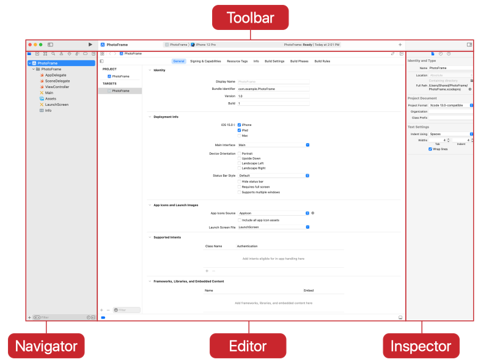
   - Toolbar
     - To check the project's status
     - To hide and show the other window areas
     - To build and run your app from the big "Play" button
   - Navigator
     - To move around your project; select file to open in the editor by clicking it
   - Editor
     - To edit your project files; source code, user interface items, or app configuration
   - Inspector
     - To find out more details about the item currently selected or displayed in the editor
     - Especially to edit user interface files in Interface Builder
4. Add a Photo
   1. Select Asset on teh navigator area.
   2. Drag in image files
5. Edit the Storyboard
   1. Open the storyboard by selecting `Main` from the list of files in the project navigator.
   2. Change the Device.
      1. Click the Devices icon at the bottom of the window and select iPhone 13 Pro.
   3. Select the main view.
      1. Click anywhere in the scene to select its main view.
      2. In the Document Outline to the left, you'll notice that the View Controller Scene expands to show the items it contains, and the View item is highlighted.
   4. Show the Attributes inspector.
   5. Adjust the background color.
   6. Run you app
6. Adding a Frame
   1. Open the Object library, type `UIView`
   2. Drag `View` in the center of the view controller.
   3. Resize to make the view large enough to display your photo.
   4. In the Attributes Inspector, select the menu next to Background, select Custom, and choose a color from the color picker.
7. Adding and Configuring an Image View
   1. Open the Object library, type `image`
   2. Drag `Image View` into the frame view.
   3. Resize the image view until the frame behind it is the right width.
   4. In the Attributes Inspector
      1. Choose the image you added earlier at the top of the inspector.
      2. Select Content Mode to Aspect Fill.
         - 

### Design For People

## Algorithms

### Get Started With Algorithms

- An algorithm is a set of instructions for accomplishing a task.
- There are three essential building blocks in all algorithms: `sequencing`, `selection`, and `iteration`.
- Sequencing
  - Arranging instructions in order is called sequencing, and it's one of basic techniques for creating an algorithm.
  - Swift uses sequencing as it executes your code line by line and from top to bottom.
- Selection
  - Selection lets you describe multiple paths through your algorithm.
  - By using selection, you can examine the conditions at the time your code runs and your program will proceed along one of many possible paths.
- Functions
  - In Swift, you use functions to group instructions together and give them a name.
  - By breaking a problem into pieces, you can write functions to solve each piece independently.
  - You can combine them to solve the bigger problem.
  - The approach of grouping instructions into a unit and giving that unit a name is call `procedural abstraction`.
  - Remember, the key feature of any kind of abstraction is to hide, or encapsulate, the details of how something works.
  - After you've written and tested a function, you no longer have to think about how it works, just about what it does.
- Types
  - Swift uses the term type to describe each different kind of value.
- Parameters
  - You use parameters to define the input that goes into a function.
  - Each parameter for a function has a type.
  - By adding parameters to functions, you can make them more flexible so they can be used in a variety of situations.
- Making Decisions with Booleans
  - The yes-and-no answers are represented in Swift as "true" and "false."
  - They are known as Boolean values, named after George Boole, a 19th century mathematician.
  - The Bool type is used in Swift to represent Boolean values.

### Play with Programs

- Functions

  - Reusability is a large part of what makes functions so powerful.
  - Any identifier followed by parentheses, `()`, is a function.
  - The code between the two braces, `{...}`, is called the body of the function.
  - Nothing is displayed in the results because declaring a function only describes what the function would do if it ever run.
  - To actually run the code, you have to call the function. Typing the name of the function will call the function.
  - Decomposition: break a single long list down into multiple smaller lists.

- Types

  - String
  - Number is Int, an abbreviation of integer.
  - Swift keeps track of the type of the variable and makes sure you don't accidentally try to assign a value of a different type.
    - The value of a variable can change, but the type of the variable can't change.
  - Type Safety: Swift won't let you write code that uses types incorrectly or unexpectedly.
    - Another instance of type safety would occur if you tried to add values of different types.
  - A literal is the simplest form of expression.
  - Swift makes assumptions about what types the literals are meant to be.
    - Any value inside double quotes will be treated as a String, and a whole number will be treated as an Int.
    - Type Inference: Swift uses context clues from code to infer what type something is.
  - Check the type by holding down the `Option` key while clicking a variable.
  - You can add an extra piece of information, called a `type annotation`, to tell Swift exactly what type you want to use.
    - `let annotationDouble: Double = 20`
    - `annotationDouble` is a Double, even though there is no decimal point, because of the type annotation.
  - All type names begin with a capital letter. If there are multiple words the first letter of each word is also capitalized.
    - This is slightly different from the rules for naming constants, variables, and functions, which all begin with lower-case letters.
  - Types and capabilities can be grouped together into collections called `frameworks` or `libraries`.
    - To use a framework in your program, you have to import it like `import Foundation`.

- Parameters and Results

  - Declare: `func functionName(parameter: Type) {...}`
  - Call: `functionName(parameter: argument)`
  - Passing a value back when a function is finished is called returning a value. To declare a function that returns a value, you have to add two things to your code.
    - After your list of parameters, add a text arrow `->` and the type of value to be returned.
    - Then you have to end the body of the function with a return statement that gives that type fo value back.
    - `func functionName(parameter: Type) -> Type { ... return ...}`
    - Your function can have multiple parameters, but it can only return one value.
  - When a function does some kind of work that's unrelated to a return value, like printing to the console, the work is call a `side effect`.
    - When you name a function, it's good to somehow include the side effect in the name.
    - If a function has no return value, all of its work is considered a side effect.
    - A function that has a side effect should have a verb in the name.
  - The order that code executes in a program is called `control flow`.
  - When your code calls a function, the following line doesn't execute until after the function returns.
  - `func functionName(argumentLabel parameterName: Type) {...}`

    - ```swift
        func printHello(to name: String) {
          print("Hello " + name)
        }
        printHello(to: "Chris")
      ```

  - To declare a parameter without an argument label, you use the underscore `_` where the argument label would go.
  - In Swift, the underscore means "I don't care about this item because I'm not going to use it."

    - ```swift
        func printHelloTo(_ name: String) {
          print("Hello " + name)
        }
        printHelloTo("John")
      ```

- Making Decisions

  - Clean code
  - Conditionals are perfect opportunities to write helpful functions. If you have some decision-making code that doesn't read easily or makes things look to complicated, you can wrap it in a function and make it look like you're asking a question.

    - ```swift
        if gearWeight < totalCarryingCapacity {
            if bulkiestItemWeight < 80 {
                "Rock on."
            } else if chanceOfRain >= 0.1 {
                "Everyone quits! Looks like you've got a solo show."
            }
        } else {
            "Everyone quits! Looks like you've got a solo show."
        }
      ```

    - ```swift
        if gearWeight < totalCarryingCapacity && (chanceOfRain < 0.1 || bulkiestItemWeight < 80) {
            "Rock on."
        } else {
            "Everyone quits! Looks like you've got a solo show."
        }
      ```

    - ```swift
        func bandCanCarryGear(bandMemberCount: Int, gearWeight: Int, bulkiestItemWeight: Int, chanceOfRain: Double) -> Bool {
            let maximumTripCount = 2
            let weightPerPerson = 50
            let totalCarryingCapacity = bandMemberCount * weightPerPerson * maximumTripCount

            return gearWeight < totalCarryingCapacity && (chanceOfRain < 0.1 || bulkiestItemWeight < 80)
        }
        if bandCanCarryGear(bandMemberCount: 5, gearWeight: 650, bulkiestItemWeight: 60, chanceOfRain: 0.05) {
            "Rock on."
        } else {
            "Everyone quits! Looks like you've got a solo show."
        }
      ```

- BoogieBot

  - Functions are the way programmers group blocks of work together.
    - A function is reusable, which saves on reading and typing.
    - A function can be understood on its own, so you don't have to think of every single step.
    - If a function is changed, the changes apply everywhere the function is used.

- Data Visualization

### Build a QuestionBot App

- Rather than running the app several times as you develop your code, you can use a playground to get your question answerer up and running more quickly.
- You can see multiple results instantly, and there's no need to return.
- Once you're happy with your code, you'll use it to replace the existing code segment in QuestionBot.

#### Building Your Function

- QuestionAnswerer.playground

  - ```swift
      import Foundation
      func responseTo(question: String) -> String {
          let lowerQuestion = question.lowercased()

          if lowerQuestion.hasPrefix("hello") {
              return "Why, hello there"
          } else if lowerQuestion.hasPrefix("where are the cookies?") {
              return "In the cookie jar!"
          } else if lowerQuestion.hasPrefix("where") {
              return "To the North"
          } else if lowerQuestion.hasPrefix("can i") {
              return "Yes, you can"
          } else if lowerQuestion.contains("your name") {
              return "My name is QuestionBot."
          } else if lowerQuestion.contains("what time") {
              return "\(Calendar.current.component(.hour, from: Date())):\(Calendar.current.component(.minute, from: Date()))"
          } else {
              if lowerQuestion.count % 2 == 0 {
                  return "Thank you for asking, but I have no idea."
              } else {
                  return "Please ask it tomorrow."
              }
          }
      }

      responseTo(question: "Hello there")
      responseTo(question: "Where are the cookies?")
      responseTo(question: "Where should I go on holiday?")
      responseTo(question: "Can I have a cookie?")
      responseTo(question: "Should I go?")
      responseTo(question: "What time is it?")
    ```

#### Updating the App

- common problems:
  - **The app runs but you don't see the answers** you were expecting. This is probably because you pasted the function in the wrong place. Perhaps it was in the wrong file, or in the wrong place in the correct file.
  - The app doesn't build with an error that reads **Unexpected non-nil return value in void function**. You probably pasted the function body code from the playground into the wrong function in the project.
  - The app doesn't build with an error that reads **Invalid redeclaration of responseTo(question:)**. This means you have two functions with the same name in the same area of the code - not allowed because it isn't clear which function should run when called.
  - The app doesn't build with an error that reads **Expected declaration**. You may have inadvertently replaced the entire function, declaration and all, with only the body of the function from your playground, or you pasted the function body into the wrong place.
  - The app doesn't build with an error that reads **Missing return in a function expected to return 'String'**. You probably pasted an entire function inside another one.
  - The app doesn't build with an error that reads **Closure expression is unused** or **Expressions are not allowed at the top level**. You probably pasted the body of your function into a file without any context - with no `func` keyword.
  - The app doesn't build with an error that reads **Use of unresolved identifier 'MyQuestionAnswerer'**. You probably replaced the entire `struct MyQuestionAnswerer` with the `responseToQuestion` function or its body.

#### Customizing the Interface

- Open the Main.storyboard, and make sure the Attributes inspector is visible.
- Background Color
  - Select View under View Controller, and use the Background attribute to choose a different color.
- Robot Head
  - Select the Robot Head label under Stack View
  - Using the Text attribute in the inspector, change the emoji to a different character.
  - Press `Ctrl + CMD + Space` to bring up the emoji picker.
- Welcome Message
  - Select Response Label in the Document Outline and change the opening text.
  - Pressing `Ctrl + Return` to add a new line if you need one.

### Design an Experience

- Design isn't just about how a product looks and feels; it's also about how it works.
- A crucial step in designing successful computing innovations is understanding the people who will use the innovation.
- When your design incorporates diverse perspectives, it will improve the experience for all users.
- Apple has four key principles around designing for user privacy:
  - Request consent when your app needs personal data.
  - Be transparent about how personal data will be used.
  - Give the user control over their personal data and protect the personal data you collect.
  - Use the minimum amount of personal data required.

#### Plan

- You need to consider how your main screens will look. Refer back to your design mood board for inspiration, and sketch a few screens.
- 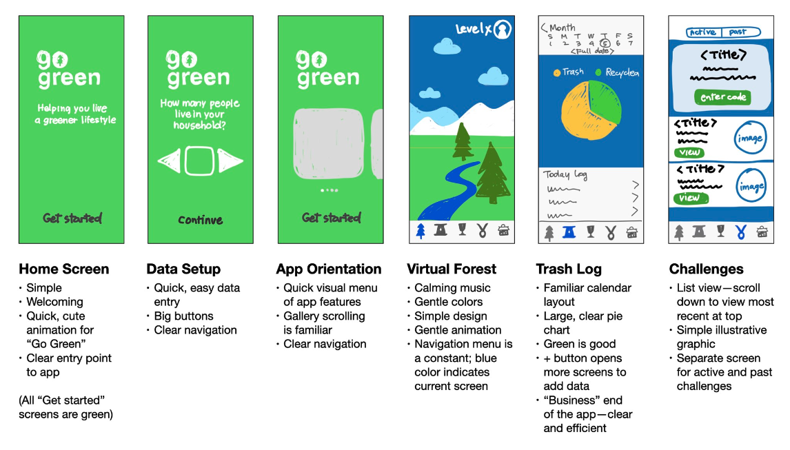
- Show how a user will move through the screens - a storyboard.
  - You can create a storyboard by organizing the screens in a flowchart and indicating the graphic elements that enable users to make choices within the app.
  - 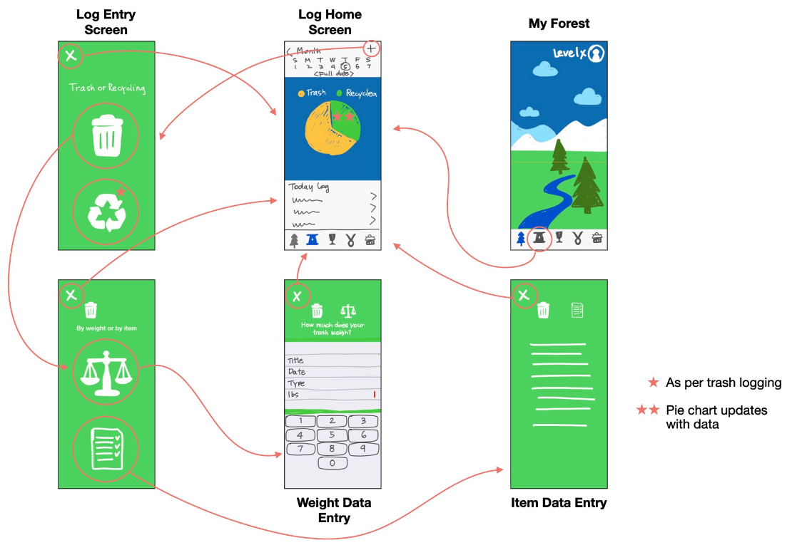

#### Create a User Experience Flowchart

- Take photos or screenshots of your screens and add them to Keynote.
- The flowchart should show how a user can move through your app based on the choices they make.
- Annotate your storyboard to explain key features of the app, and highlight the accessibility features you've incorporated.
- Apple provides [resources](https://developer.apple.com/accessibility/) to support developers to build accessible apps.

#### Review and Iterate

- Simplification is a key idea in the app design process.
- If you're very clear about purpose, you can simplify your design so your app fits seamlessly into the flow of the user's activity.
- Share your storyboard with your peers or mentors.
  - As they explore your app design, encourage them to ask you How? Why? and What if? questions. You can record their responses or annotate your storyboard with their queries and ideas.
  - With a partner, take turns examining each other’s designs through the lens of someone who has a disability. (You can consider four broad categories: vision; hearing; physical and motor; and learning and literacy.)
  - Each of you should adopt a specific persona and explain your requirements when using an app. Then work through the app and give feedback from that person’s point of view. Together, identify ways you could improve the app to make it more inclusive.
- App design is an iterative process, and identifying problems and issues can be seen as an opportunity rather than a setback. If you need to, return to the brainstorming phase and use your new insights to revise your app idea. Great apps are the product of extensive ideation, exploration, testing, and revision.

## Organizing Data

### Get Started With Organizing Data

#### Instances, Methods, and Properties

- Types enable you to understand what each value in your code represents.
- Type safety in Swift ensures that you use values of the right type in the right place.
- Types can also define or describe the attributes and behaviors of a particular kind of thing - in other words, what a type is, or knows (its attributes), and what it does (its behaviors).
- In Swift, the attributes of a type are called `properties`, and its behaviors are called `methods`.
- Even though the type describes the properties and methods of a particular kind of thing, each concrete example of the type is a separate, independent instance of the type.

#### Lists and Arrays

- In Swift, such a collection is called an array.
- An array is a collection of individual instances of just one ypte.
- Each instance in the array is called an element.
- Each element in an array has a unique index, which identifies its location in the array respective to the first element, which is always located at index 0.

#### Algorithms: Iteration

- In algorithms, repeating the same swquence of steps multiple times is known as iteration.
- In Swift, as well as all other programming languages, iteration is critical building block of algorithms.
- Remeber - algorithms have three basic building blocks: sequencing, selection, and iteration.

#### Loops

- The term for iteration in most programming languages, including Swift, is a loop.
- A loop defines a code segment that will be repeated - its body - and a determination for when to exit the loop.

#### Working With Arrays - Searches

- It can be very useful to apply a function to every item in an array, but what if you just wanted to perform that function on one particular item?
- You would need to find that item's location in the array - its index - and specify that you were performing the function on the item at that location.
- Finding an item in an array (or determining that it's not there) is called searching, and there are multiple algorithms for performing a search on an array.
- Linear search
  - It isn't as efficient as binary search because it works by evaluating the items in the list one after the other - which means it might have to evaluate the entire list before it finishes.
- Binary search
  - The approach works by successively splitting finding the middle element and comparing the sought value to the middle element.
  - If the value is greater, the first half of the list can be eliminated.
  - If the value is less, the second half can be eleminated.
  - If the value is equal to the middle element, the algorithm has found the value in the list.
- Binary searches are more efficient that linear searches, especially with large amounts of data, but require that the data be in sorted order.

#### Defining Your Own Types With Structs

- In Swift, you can create types of your own that group lots of attributes together.
- A very common way to create a new type in Swift is to define a `struct`.
- When you make your own struct, you define properties that represent all the attributes of the thing they represent.
- In the definition of your struct, you'll also probably include methods to perform useful tasks.

### Play with Complex Data

#### Experiment with Organizing Your Code

##### Code - Instances, Methods, and Properties

###### Instances

- You can create and use different instances of a given type.
- Each instance has its own set of property values, and each instance can perform behavior independent of other instances.
- Creating an Instance
  - You've created almost every instance by typing a literal value directly into code.
  - The exception was in the Types playground, where you used `Date()` to create a value holding the current time.
  - `Date()` looks a lot like a function, but with an important difference: It uses a type name instead of a name beginning with a lowercase letter.
  - You use an initializer to create a new instance of a particular type.
  - Only a few types, like String, Bool, and Int, can be created using literals, but every type has at least one initializer.
  - Even types you've been creating using literals have initializers.
  - You'll often want to provide more information when you create an instance.
  - Many types have initializers with parameters to let you do this:
    - `let oneHourLater = Date(timeIntervalSinceNow: 3600)`
    - This initializer gives you a Date that is a number of seconds from the current time.
  - Initializers and functions are similar in some ways:
    - They can have parameters or no parameters at all.
    - You call them the same way, by passing in required argument values.
  - They also have differences:
    - You use the name of the type when calling an initializer.
    - An initializer returns a new instance of its type.

###### Methods

- Functions can be defined as part of a type.
- These functions are called instance methods, or just methods.
- String has many instance methods, which are used for common operations.
- It's often useful to know if a string begins with another string. The method `hasPrefix()` can answer this question.
  - The method is declared like this: `func hasPrefix(_ prefix: String) -> Bool`
  - The method `hasPrefix()` has a String parameter, which is the prefix you want to test, and returns a Bool.
  - Instance methods are called by using a period (.) after the instance, followed by the method call:
    - `introduction.hasPrefix("It was")`
    - This is known as calling a method on the instance. You've called hasPrefix() on introduction.

###### Methods and Type Safety

- Type safety still applies when you're using instance methods. hasPrefix is a String instance method, so you can't use it without an instance.
- You also can't use an instance method on an instance of the wrong type. You can only use methods that are part of, or members of, a particular type.

###### Properties

- Each instance has one or more pieces of associated information. These values are known as properties.
- It's often useful to know if a string contains any characters at all. The property `isEmpty` answers this question.
- The property is declared like this: `var isEmpty: Bool { get }`.
  - It is marked `var` because the property value could change if the string contents change.
  - The `{ get }` indicates you can only get the value of this property, but you can't set it.
  - This is also called a `read-only` property.
- Properties are called by using a period (.) after the instance, followed by the property name:
  - `something.isEmpty`
- The same type safety rules apply for properties as with methods.

###### Properties Versus Methods

- Variable Versus Function
  - The different between a method and a property is similar to the difference between a function and a variable or constant.
  - A variable is useful for **referring to a value** that you can access when required. Similarly, a property provides a way to get or set a value that's part of an instance. Each instance can have a different value for that property.
  - A function is useful for **providing behavior** that can be repeated as needed. A method works in the same way, providing behavior specific to that instance.
- Arguments
  - If the work you want to perform needs extra information, then it must be a method, since you can't pass arguments to a property.
  - That means `hasPrefix()` must be a method, because you need to pass in the prefix you're testing for.
- Side Effects
  - If the work has side effects, things that happen that aren't related to the return value, then it's a method.
  - For example, String has a method, `removeAll()`, which empties the string.
- Values
  - Properties are for getting values from an instance and for setting values on an instance. Properties don't do any additional work.
- Methods and properties help to break down the complexity of a large program by putting related pieces of information (properties) and work to be done (methods) together in a single self-contained package (an instance).
- The are significant advantages to using methods and properties over top-level functions(not contained in anything else) and variables:
  - Putting the capabilities of a type together with the type itself makes the code easier to understand.
  - Autocompletion works mach better: Autocompletion only supplies the methods that can apply at the point your're typing. If all methods were top-level functions, then whenever you started typing, every function in the system would show up.
  - Documentation is much easier to organize and find: How would you classify all the top-level functions that could do something with a string, or a number? What if a function dealt with both? How would you search this documentation?

###### APIs, Revisited

- The instance methods and properties of a String are the API(Application Programming Interface) of the String type.
- If you can sort-of-remember the name of a method or property, you can just start typing an dXcode will offer you autocompletion suggestions.
- APIs also come with documentation to help you learn about them and see how they should be used.
- One of the most important skills you'll develop as a programmer is how to find and understand things in documentation.
- Option + Click a type, method, or property and it will show you useful information.
- You can find the same information using the Quick Help inspector.
- To view this, make sure the utilities are is visible, by choosing View > Inspectors > Show Quick Help Inspector from the menu.
- Whenever your cursor is positioned, the Quick Help inspector will tell you about the code at that point.

###### Classes and Structs

- As you build apps in Swift, you'll work with instance of both structs and classes. Both provide a way to define types in Swift.
- Structs and classes have may similarities:
  - Both has instances
  - Instances are created with an initializer
  - Both can have methods
  - Both can have properties

##### Arrays and Loops

###### Arrays

- Array have two key features
  - The items in the array are all the same type.
  - The items in the array are in a specific order.
- In Swift, a list is called an array. It's an important data abstraction - a way to think about a concept, such as a list, as a unit without having to think about all its individual elements.
- Arrays, like all data abstractions, help you to simplify your code by providing solutions.
- Array literals are lists of items, separated by commas, with the whole thing inside square brackets:
  - `let devices = ["iPHone", "iPad", "iPod", "iMac"]`
- Each item in an array has an index, starting with the first item at zero. You can get the value that's stored at a particular index by putting the index in square brackets after the array name.
- If you ask for an item hat is not in the list, you can cause a serious program error.
- You can find out the number of items in array using the `count` property, which is an `Int`.
- Array is a type, but an array type in Swift also includes the type of the values in the array.

###### Array - Loops

- Swift has a built-in way to let you run code for each item in an array. It's call looping or iterating through the array.
- To run code for each item in an array, you can use a `for <variable name> in <array> { body }` loop.
- You can assign a whole different mutable array of items, but you can't change the type of items the array holds.
- To create a mutable empty array that will hold strings, do this: `var list = [String]()`.
- Once you've created the array, there are several ways to add items to it.
  - `list.append("Banana")`
  - `list.insert("Strawberry", at: 0)`
    - You can add an item at a specific index using the insert instance method. As with everywhere you use an index, it has to be within the array or the program will crash.
  - `list += ["Plum"]`
- There are also several ways to remove items from mutable arrays.
  - `let someNumber = numbers.remove(at: 2)`
    - You can remove items using the index. The index has to be within the array.
    - The `remove(at:)` method returns the item you have removed.
  - `let firstNumber = numbers.removeFirst()` and `let lastNumber = numbers.removeLast()`
    - You can remove the first item using `removeFirst()`.
    - Using `removeFirst()` or `removeLast()` on an empty array will cause an error.
  - `numbers.removeAll()`
    - You can remove everything using `removeAll()`.
    - This doesn't return anything.
- In Swift, the part of the statement [0] is called a `subscript`.
- With a mutable array, you can use the subscript to set the value at an existing index, replacing the value that is already there.
  - `flavors[0] = "Chocolate"`
- You can replace values in a mutable array using subscripts, you can't add or remove things.

##### Structures

###### Modeling Data

- In general, the types of data that an app deals with are known collectively as its model, or sometimes more verbosely, its data model.
- If you have information as arrays, you'd need to access the differnt arrays using the same index.
- It would be better to have data instead of arrays. The term for this higher-level concept is data abstraction.
- One way to create a new type in Swift is to define a structure, often called a struct.
- As a data abstraction, a struct provices some distance between the abstract properties of a data type, and its concrete representation.
  - Its name should begin with a captial letter. Property names should begin with lower case letter.
- Using data abstraction can result in a program that is easier to develop and maintain.
- An array is a kind of struct and you can make your own structs mutable or immutable.
- To make the properties of your custom structs mutable there are two things you need to do:

  - In the definition of the struct, declare any changeable properties using var.
  - Assign the struct to a variable, not a constant.

  - ```swift
      /* arrays */
      let songTitles = ["Ooh yeah", "Maybe", "No, no, no", "Makin' up your mind"]
      let artists = ["Brenda and the Del-chords", "Brenda and the Del-chords", "Fizz", "Boom!"]
      let durations = [90, 200, 150, 440]
      let song3 = "\(songTitles[2]) by \(artists[2]), duration \(durations[2])s"

      /* data */
      struct Song {
          let title: String
          let artist: String
          let duration: Int
          var rating: Int
      }
      let song = Song(title: "No, no, no", artist: "Fizz", duration: 150, rating: 0)
      song.rating = 4
    ```

###### Computed Properties

- A Song has a duration property, measured in seconds. But it would also be useful to ask a song for its duration as a string formatted in minutes and seconds.
- To solve this, you could have two properties, minutes and seconds, but then you would need to perform a calculation to find out the total duration.
- Alternatively, you could have three properties - minutes, seconds, and duration - but it would be easy to create a struct with inconsistent data, where the duration value didn't add up to the right number of minutes and seconds.
- A better approach to the problem would be to calculate the formatted string from the duration value.
- For properties that can be calculated on demand, you can add a computed property to the struct like this:

  - ```swift
      struct Song {
        let title: String
        let artist: String
        let duration: Int

        var formattedDuration: String {
          let minutes = duration / 60
          let seconds = duration % 60
          return "\(minutes)m \(seconds)s"
        }
      }
      let song = Song(title: "No, no, no", artist: "Fizz", duration: 150)
      song.formattedDuration
    ```

- A computed property is declared as a `var`, since it could change depending on the rest of the struct. The rest of the declaration consists of a name, a type annotation, and then some code in braces, which has to return a value of the correct type. You can access the computed property just like any other.
- Not that inside the definition of formattedDuration, the property duration is accessed without dot notation.
  - Within the code of a struct, you can access its own properties directly by their names, without using the dot.
- Computed properties are a further example of the power of structs to create data abstraction. Instead of using separate functions outside the struct, you can put related functionality right alongside the data it relies on.
  - Code that uses the struct can simply use these new properties without needing to know how they work.

###### Functions

- Your own types can be passed into or out of functions, just like built-in types.

  - ```swift
      struct Rectangle {
        let width: Int
        let height: Int
      }

      func inRectangle(_ rectangle: Rectangle, biggerThan rectangle2: Rectangle) -> Bool {
        let areaOne = rectangle.width * rectangle.height
        let areaTwo = rectangle2.width * rectangle2.height
        return areaOne > areaTwo
      }

      let rectangle = Rectangle(width: 10, height: 10)
      let anotherRectangle = Rectangle(width: 10, height: 30)
      isRectangle(rectangle, biggerThan: anotherRectangle)
    ```

- This works, but there are a couple of issues:
  - The two arguments to the function are a lot of code to read in one line, which makes it harder to understand.
  - The function is available everywhere is a program, but you only need it when dealing with rectangles.
  - If you don't know there is an isRectangle() function, it is difficult to find using autocompletion.

###### Instance Methods

- A instance method is written as part of the struct definition, and so it can directly access the properties witin the instance.
- Just like the methods on built-in types, the methods you define are called using the instance name, then a dot, then the name and arguments of the method.

  - ```swift
      struct Rectangle {
        let width: Int
        let height: Int

        func isBiggerThan(_ rectangle: Rectangle) -> Bool {
          let areaOne = width * height
          let areaTwo = rectangle.width * rectangle.height
          return areaOne > areaTwo
        }
      }

      let rectangle = Rectangle(width: 10, height: 10)
      let anotherRectangle = Rectangle(width: 10, height: 30)
      rectangle.isBiggerThan(anotherRectangle)
      anotherRectangle.isBiggerThan(rectangle)
    ```

##### Enums and Switch

###### Enumerations

- In Swift, you can use an enumeration to represent a group of related choices. Each choice is called a case.
- You can define your own enumeration types, just as you can define your own structs.
- An enumeration is usually called by its abbreviation, `enum`.
- The name of an enum starts with a capital letter, like all other type names.
- The name of a case starts with a lower-case letter, like the names of properties and methods.
- The name of the enum should be singular, because the value refers to only one choice, not many choices.
- One benefit of an enum is it limits the choices to one of its cases.
- If Swift already knows what type to expect, you can skip the enum name. Since you've already specified the type of an enum instance, you can leave out the enum name when assigning a value.
- Whenever you have a restricted group of related values in your code, it might be good to think about using an enum.

  - ```swift
      enum LunchChoice {
        /*
        * case pasta
        * case burger
        * case soup
        */
        case pasta, burger, soup
      }

      /* let choice = LunchChoice.soup */
      var choice: LunchChoice
      choice = .soup
    ```

###### Enums and Functions

- Enum values can be used as parameters or return values for functions, just like any other type.
- When calling a function, you know that you have to pass in an enum. Autocompletion will tell you exactly what the options are.
- You can't pass in anything that's not on the list, so you'll always get what you're looking for.

  - ```swift
      func cookLunch(_ choice: LunchChoice) -> String {
        if choice == .pasta {
          return "🍝"
        } else if choice == .burger {
          return "🍔"
        } else {
          return "🍲"
        }
      }
      chookLunch(.burger)
    ```

###### Switch

- Apparently if statements aren't great fit when dealing with enums.
- The switch statement looks very much like the enum declaration.
- Since the type of the enums is known, you can use the dot syntax and leave out the type name.
- Switch statements have a special feature: they must be exhaustive. This means a switch statement must exhaust every possibility of the value being checked. With an enum, you can use a different case to handle every possible value.

  - You're not allowed to write a switch statement that doesn't cover every case.
  - This feature prevents you from accidentally missing a value.
  - It also alerts you if you update the definition of an enum without updating any switch statements that use it.

  - ```swift
      switch choice {
      case .pasta:
          "🍝"
      case .burger:
          "🍔"
      case .soup:
          "🍲"
      }
    ```

- If you add a default case to your switch statement, you won't get an error when you add new cases to the enum.

  - ```swift
      enum Quality {
          case bad, poor, acceptable, good, great
      }

      let quality = Quality.good

      switch quality {
      case .bad:
          print("That really won't do")
      case .poor:
          print("That's not good enough")
      default:
          print("OK, I'll take it")
      }
    ```

- A default case might cause you problems later on if you add new cases to the enum.
- The switch statement will use the default case for your new value, which may not be what you wanted.
- Instead, you can match several values in the same case:

  - ```swift
      switch quality {
      case .bad:
          print("That really won't do")
      case .poor:
          print("That's not good enough")
      case .acceptable, .good, .great:
          print("OK, I'll take it")
      }
    ```

- Switch statements can work with strings and numbers. Since it's impossible to have an exhaustive list of all string and number values, switch states using these types require a default case.

  - ```swift
      let animal = "cat"

      func soundFor(animal: String) -> String {
          switch animal {
          case "cat":
              return "Meow!"
          case "dog":
              return "Woof!"
          default:
              return "I don't know that animal!"
          }
      }
      soundFor(animal: animal)
    ```

###### Enum Methods and Properties

- You can define methods and properties in an enum.

  - ```swift
      enum Suit {
          case spades, hearts, diamonds, clubs

          var rank: Int {
              switch self {
              case .spades: return 4
              case .hearts: return 3
              case .diamonds: return 2
              case .clubs: return 1
              }
          }

          func beats(_ otherSuit: Suit) -> Bool {
              return self.rank > otherSuit.rank
          }
      }

      let oneSuit = Suit.spades
      let otherSuit = Suit.clubs
      oneSuit.beats(otherSuit)
      oneSuit.beats(oneSuit)
    ```

- The `self` keyword is used in methods and computed properties and refers to the instance that is being asked for the property value.

###### Wrapping Up

- Enumerations are used when you want to represent one of a group of related values. Each possible value is called a case.
- When you create an enum, you're making a new type. Instance of that type can only have values matching one of the specified cases.
- Using enums can make our code easier to read and write, because it's always clear what the possible values are and what they mean.
- Because switch statements must be exhaustive, you must handle every possible value. To handle any values that haven't been specified, you can use a default case.

##### Testing Code

- Your code doesn't always work as you expect it to. Testing your code will help you detect errors and make sure that your functions behave predictably.

###### Limits of Integers

- What's a `UInt8`?

  - All numbers in Swift occupy a fised number of bits. The standard Int type occupies either 32 or 64 bits, depending on the computer that's running it.
  - The `UInt8` type occupies only 8 bits.
  - The "U" in `UInt8` stands for "unsigned." An unsigned integer is always positive.
  - Values of `UInt8` range from 0 to 255.
  - When tried to store 500, a number outside of the range, the console should print "Integer literal '500' overflows when stored into 'UInt8'."
    - Overflow is the result of trying to store a number that won't fit into the number of bits available.
  - Overflow can also occur when you reach the bank's limitations as your program executes. In that case, you'll see an "EXC_BAD_INSTRUCTION" or "EXC_BREAKPOINT" error in the console.

  - ```swift
      /// Represents a piggy bank that holds only pennies.
      class PiggyBank {
          private var pennies: UInt8 = 0

          init() {
              pennies = 0
          }

          /// Returns the balance of the bank.
          func balance() -> UInt8 {
              return pennies
          }

          /// Deposits pennies into the bank.
          /// - Parameter pennies: the number of pennies to deposit.
          func deposit(pennies: UInt8) {
              self.pennies += pennies
          }

          /// Withdraws pennies from the bank.
          /// - Parameter pennies: the number of pennies to withdraw.
          /// - Note:
          func withdraw(pennies: UInt8) {
              self.pennies -= pennies
          }
      }

      var bank = PiggyBank()
      /// won't fit into the numver of bits available
      //bank.deposit(pennies: 500) // Integer literal '500' overflows when stored into 'UInt8'

      /// reach the limitations
      //bank.deposit(pennies: 100)
      //bank.deposit(pennies: 100)
      //bank.deposit(pennies: 100)  // error: Execution was interrupted, reason: EXC_BREAKPOINT (code=1, subcode=...).
                                    // The process has been left at the point where it was interrupted, use "thread return -x" to return to the state before expression evaluation.

      /// assign a negative number ot a UInt8
      //bank.deposit(pennies: 50)
      //bank.withdraw(pennies: 100) // error: Execution was interrupted, reason: EXC_BREAKPOINT (code=1, subcode=...).
                                    // The process has been left at the point where it was interrupted, use "thread return -x" to return to the state before expression evaluation.
    ```

###### Documentation

- When you write functions and methods, you should document them to indicate the conditions under which they function.
- Documentation has important uses:
  - To identify appropriate values for testing
  - To make your code easier for yourself and others to read and understand
  - To serve as the basis for published documentation of an API
  - To capture your thought process as you code
- If you use the special comment format `///`, you'll get a bonus: Swift will automatically create and format documentation that you can access by Option-clicking the item - just as you do for internal types.
- There are `/// - Note:`, `/// - Parameter` as the above

###### Testing

- When you test a function, you should choose a range of values - including some that extend beyond the limits that the function expects.
- Make some test cases below by creating instances of PiggyBank and calling the two methods with values that should produce valid results - as well as some tests that should cause it to crash.
- Verify valid results by comparing the method call to the expected output as demonstrated. (You'll have to comment out the tests that crash your code in order to have them alongside other tests.)

  - ```swift
      // Test a legal deposit amount
      var bank1 = PiggyBank()
      bank1.deposit(pennies: 100)
      bank1.balance() == 100 // this should be true
    ```

###### Limitations of Floats

- Like Int and UInt8, Swift floating point types are represented in a fixed amount of space - a Double occupies 64 bits.
- As a result, some floating point numbers can't be represented exactly; they can only be approximated.
- The problem is that Doubles don't always work the way you expect them to.
- Some strange behavior is going on. Due to the limitations of the Double type, the Dobule literal 8.95 isn't acutally that value when it's represented in the computer.
- So when you multiply it by 100, the result isn't 985.0, but 894.000....
- Doubles have other limitations as well, such as those that only crop up in addition operations.
- A quick solution is to multiply the value by 100, then round to the nearest cent - before converting it to an Int.

  - ```swift
      let price = 8.95
      let priceInPennies = price * 100
      let roundedPriceInPennies = priceInPennies.rounded() // Produces a new Double
      let integerPriceInPennies = Int(roundedPriceInPennies) // Produces an Int
    ```

##### Processing Data

- Outside the confines of their code, developers have to contend with the real world in all its messiness. When it comes to data, you'll often find that what you get isn't what you expect. Sometimes the data is incomplete, or needs to be combined with other data sources to present a complete picture. Even when a data set is complete, sometimes it has to be cleaned in order to use it properly. Cleaning data can take several forms depending on its nature. (And knowing how to code makes it possible to clean data much more efficiently than if you had to do it by hand.)
- Cleaning data is one way to transform it—to make it more suitable to the task at hand, or more accurate. Beyond transformation, you can translate data by putting it into new contexts or deriving extra information from it.
- You've also learned the value of using third-party code and the proper way to cite it. If you hadn't paid attention before, you'll surely notice now that the license on this page (and on the final page of all the playgrounds in this course) is identical to the license for the third-party code you used.

#### Creatively Apply Your Thinking

##### Pixel Art

- All the pages in this playgournd have a `display` instance whose type is `PixelDisplay`. The properties and methods of PixelDisplay provide the interface to your low-resolution graphics display.
- The display on this page has 64 pixels in an 8-by-8 grid. Pixel coordinates are zero-indexed, just like arrays.
- The `setPixel(x:y:color)` method addresses an individual pixel at the specified x and y location. The Color type has several predefined values, as shown below.
  - display.setPixel(x: 5, y: 2, color: .purple)
- You can also create any color you want. The Color type has three initializers. You can use autocompletion to discover them.
  - `display.setPixel(x: 7, y: 7, color: Color(red: 0.8, green: 0.2, blue: 0.7))`
- The `backgroundColor` property of PixelDisplay controls the display color.
  - `display.backgroundColor = .cyan`
- Create functions to make horizontal and vertical lines.

  - ```swift
      func hline(x: Int, y: Int, length: Int, color: Color) {
          for i in 0 ... length - 1 {
              display.setPixel(x: x + i, y: y, color: color)
          }
      }
      func vline(x: Int, y: Int, length: Int, color: Color) {
          for i in 0 ... length - 1 {
              display.setPixel(x: x, y: y + i, color: color)
          }
      }
      /* rectangular block */
      hline(x: 1, y: 1, length: 5, color: .purple)
      hline(x: 1, y: 4, length: 5, color: .purple)
      vline(x: 1, y: 1, length: 4, color: .purple)
      vline(x: 6, y: 1, length: 4, color: .purple)
    ```

- Create a block function to create a rectangular block of color.

  - ```swift
      func block(x: Int, y: Int, width: Int, height: Int, color: Color) {
          for i in 0 ... height - 1 {
              hline(x: x, y: y + i, length: width, color: color)
          }
      }
      block(x: 1, y: 1, width: 12, height: 4, color: .purple)
    ```

- Fill Speed
  - If you created a large enough block, you might observe the playground reaching its speed limit.
  - `batchSetPixels` takes an array of Pixels rather than just one. By passing in many pixels as an array, you're setting them all at one - rather than one at a time.
  - But that would only partially solve the problem - you'd still have to draw your lines one after the other.
  - A better solution is to modify your block function to use a nested loop.
- Composition

  - In computer graphics, it's common to repeat graphic elements.

  - ```swift
      func block(x: Int, y: Int, width: Int, height: Int, color: Color) -> [Pixel] {
          var pixels = [Pixel]()
          for x in x ... x + width - 1 {
              for y in y ... y + height - 1 {
                  pixels.append(Pixel(x: x, y: y, color: color))
              }
          }
          return pixels
      }
      display.batchSetPixels(block(x: 18, y: 10, width: 2, height: 4, color: .blue))
    ```

- `wait()` method pauses the display for a given period of time before continuing to the next drawing operation.
- Along with the `clear()` method, `wait()` enables you to create animations by drawing something, pausing for a beat, clearing the screen, and updating the drawing.

  - ```swift
      var frameTime = 1.0 / 30.0

      for i in 0...39 {
        display.setPixel(x: i, y: 5, color: .purple)
        display.wait(time: frameTime)
        display.clear()
      }
    ```

##### Password Security

- Develop an algorithm that rejects insecure passwords.
- The first step is to ensure that the user hasn't chosen one of the most commonly used passwords, which hackers are sure to try first.
  - It's the easiest way to get into somebody's account, since it doesn't require a sophisticated algorithm to make a guess.
  - Use the `contains()` method of Array to make sure the use hasn't chosen one of common passwords.
    - `commonPasswordsArray.contains("password")`
  - Display a message informing the user whether or not they've chosen a secure password.
- If you require the user to include nonalphabetic characters, there'll be some amount of randomness even if the password includes dictionary words.
- You might also require passwords be a minimum length.
  - The longer a password, the longer it takes for a hacker to try all possibilities.
- Use the following rules:
  - At least 16 characters
  - At least one regular letter
  - At least one digit
  - At least one punctuation character
- Even though `String` and `Array` are different types, they're both sequences - that is, they arrange their elements in a particular order.
  - The `for...in` loop has a special superpower: It works on any sequence, not just an arrays.
  - Use the `contains()` method to check each character against the predefined arrays above to see whether they satisfy one of the rules.
  - After checking all the characters in the password, write a final conditional statement to check whether you found at least one of each type of required character.
- You could also verify that a password contains at least one uppercase letter and one lowercase letter.
  - To detect whether a character is uppercase, use the `isUppercase` property.
- Another useful check is making sure that the password doesn't contain the username

###### Brute-Force Guessing

- A brute force attack is a hacking method that uses trial and error to crack passwords, login credentials, and encryption keys.
- The `passwordIsCorrect(_:)` function acts as the login form for a hypothetical web service, returning true when the correct password is entered.
- The `guessPasswordOfThreeCharacters(containing:)` function uses a brute-force algorithm to try all possible combinations of the characters passed in.
- This function is used below to guess a purely numeric password. Looking at the results bar on the right, you'll notice it guesses the correct password on the 124th try.

  - ```swift
      import Foundation

      func passwordIsCorrect(_ password: String) -> Bool {
        return password = "123"
      }

      let digits = "0123456789"
      let punctuation = "!@#$%^&*(),.<>;'`~[]{}\\|/?_-+= "
      let lowercaseAlphas = "abcdefghijklmnopqrstuvwxyz"
      let uppercaseAlphas = lowercaseAlphas.uppercased()

      func guessPasswordOfThreeCharacters(containing characters: String) {
        var password: String = ""

        for a in characters {
          for b in characters {
            for c in characters {
              password = String(a) + String(b) + String(c)
              if passwordIsCorrect(password) {
                print("Found password: \(password)")
                // The return statement below means that the function exits
                // early when the password is guessed, rather than executing
                // all loops to completion.
                return
              }
            }
          }
        }
      }

      guessPasswordOfThreeCharacters(containing: digits)
    ```

- Because the algorithm contains a loop within a loop within a loop, you have to multiple the iterations of each loop to calculate the number of times the innermost statement.
- As a result, the algorithm is exponential. It operates as a function of the power of the number of possible characters.
- Exponential algorithms are said to run in unreasonable time because the time for them to run grows very quickly as the problem size increases.

##### Visualization Revisited

- The API you'll learn now will strip away that layer so you can work directly with the items underneath.

###### Pie Charts, Revisited

- The new API for pie charts exposes two new types: PieWedge and PieChartView.
- The `PieWedge` struct gives you several ways to create visual effects with pie charts. It has the following properties:
  - `proportion`: The percentage of the pie occupied by the wedge, expressed as a Double.
  - `color`: The color of the wedge. You can use any one of the following values.
    - .black, .blue, .brown, .cyan, .darkGray, .gray, green, .lightGray, .magenta, .orange, .purple, .red, .yellow
  - `scale`: The radius of the wedge relative to the pie's natural radius, expressed as a Double.
    - Less than 1.0 will make the wedge smaller than normal-sized wedges, and greater than 1.0 will make the wedge larger (typically the desired effect).
  - `offset`: The distance a wedge lies from the center of the pie, relative to the size of the wedge.
    - An offset of 0 keeps the wedge at the center of the pie. An offset of 1.0 moves the center point of the wedge to where its outer edge would be.
- The `makePieChart()` function creates an instance of a `PieChartView` named `pieChartView`.
  - `PieChartView` has one property named `wedges`, which is an array of PieWedge instances.
  - Assign an array of wedges to this property, or use the `append()` method of Array to add them one at a time.
  - `PieChartView` also has a property named `labelDisplayStyle`, how labels are displayed, expressed as a `WedgeLabelDisplayStyle`.
    - `WedgeLabelDisplayStyle` is an enum with the following cases:
      - `interior`: Labels are displayed inside wedges.
      - `exterior`: Labels are displayed just outside wedges.
      - `none`: Wedges aren't labeled.
- `makePieChart()` also creates a `key` named `keyView`.
  - It's an instance of `ChartKeyView`, which has a `keyItems` property.
  - `keyItems` is an array of `ChartKeyItem` instances.
  - `ChartKeyItem` has the following properties:
    - `color`: The color swatch displayed in the key. You can use any of the color of the wedge.
    - `name`: The text to display expressed as a String.
- Until now, you've specified colors, each starting with a period, from a fixed list. But that list represents a very small view into a full-featured type named Color.
- For fine-grained color control, Color has several useful initializers that take arguments of type Double.
  - init(red:green:blue:alpha:) takes Double arguments, each ranging from 0 to 1, indicating the amount of red, green, blue, and alpha that make up the color. Alpha is the transparency level: An item with partial transparency (any alpha less than 1.0), will blend its color with the colors of items underneath it.
  - init(hue:saturation:brightness:alpha:) also takes Double arguments. Instead of mixing the red, green, and blue primary colors, this initializer defines a color by its hue, saturation, and brightness, as well as its transparency. Hue ranges from red, at 0.0, through the rainbow spectrum of orange, yellow, and so on, until wrapping back to red at 1.0. Saturation, from 0.0 to 1.0, describes how much "color" is in the color. (Imagine the difference between a bucket of pure red paint versus a bucket of white paint with one drop of red paint added to it.) Brightness is the relative darkness or lightness of a starting color, from black at 0.0 (no brightness) to white at 1.0 (full brightness).
  - init(white:alpha:) is a quick way to create grayscale colors with just two Double arguments.
- All of the color names you've been using, such as .red and .black, are just properties of the Color type.
- They're special properties called class properties because they're part of the type itself, not part of its instances.
- So instead of creating a new Color and then referring to its black property, you just refer to the black property of Color itself, like this: Color.black.
  - Because Swift is good at type inference, you can leave out the Color part of this expression when using it in a place where a Color is expected.
  - For example, the color property of both PieWedge and ChartKeyItem is actually a Color.

###### Bar Charts, Revisited

- The new API exposes an instance of `BarChartView` named `barChart`.
- There's also a `ChartBar` struct which is used to specify the bars themselves.
- `ChartBar` has the following properties:
  - `length`: The size of the bar, expressed as a `Double`.
  - `color`: The color of the bar, expressed as a `Color`.
- `BarChartView` has several properties:
  - `bars`: An Array of ChartBars.
  - `yAxisMinimum`: The minimum value of the Y axis, expressed as a `Double`.
  - `yAxisMaximum`: The maximum value of the Y axis, expressed as a `Double`.
  - `seriesLabels`: An Array of Strings to display labels along the X axis with equal spacing.
- As with the pie chart, you'll also get an instance of `ChartKeyView` called `keyView`.
- You also have three new enums that control the look of horizontal axis labels on your bar charts. They are:
  - `AxisLabelGravity`
    - `top`: Axis labels will align to the top of the axis label area.
    - `bottom`: Axis labels will align to the bottom of the axis label area.
  - `AxisLabelAttachment`
    - `beginning`: Axis labels will attach at the beginning of the text.
    - `end`: Axis labels will attach at the end of the text.
  - `AxisLabelDistributionStyle`
    - `endToEnd`: Axis labels will be distributed evenly, with the first and last labels aligning with the beginning and end of the axis, respectively.
    - `centeredIntervals`: Axis labels will be distributed evenly with equal amounts of space around them.
  - Three new properties of BarChartView let you control the look of the series labels:
    - `seriesLabelGravity`, of type AxisLabelGravity
    - `seriesLabelAttachment`, of type AxisLabelAttachment
    - `seriesLabelDistributionStyle`, of type AxisLabelDistributionStyle

###### Plots, Revisited

- This version of the API also exposes some new types to help you create better scatter plots.
- `PlotView` displays your plot data. `makePlot()` creates an instance named `plotView`.
- The plot data is a series of `PlotPoint` - instances, stored as an array in the points property.
- `PlotView` has the following properties:
  - `points`: An Array of PlotPoints.
  - `yAxisMinimum`: The minimum value of the Y axis, expressed as a Double.
  - `yAxisMaximum`: The maximum value of the Y axis, expressed as a Double.
  - `xAxisMinimum`: The minimum value of the X axis, expressed as a Double.
  - `xAxisMaximum`: The maximum value of the X axis, expressed as a Double.
- `PlotPoint` has the following properties:
  - `x`: The X coordinate of the point, expressed as a Double.
  - `y`: The Y coordinate of the point, expressed as a Double.
  - `color`: The color of the point, expressed as a Color.
  - `size`: The size of the point, expressed as a Double.
- You can use several initializers to create a PlotPoint instance.
- The color will default to .black and the size to 5: `init(x:y:f)`
- The size will default to 5: `init(x:y:color:)`
- You specify all properties: `init(x:y:color:size:)`
- As with pie charts and bar charts, you'll also get an instance of `ChartKeyView` called `keyView`.
- How do you want the data points on your scatter plots to display? PlotPoint actually has one final property, named symbol, of type Symbol.
- `Symbol` is an enum with the following cases:
  - `circle`
  - `square`
  - `diamond`
  - `triangle`
  - `x`
  - `plus`
- You can use these new properties by calling a new initializer for PlotPoint: 'init(x:y:color:size:symbol:)'
- PlotView itself gains the capability to draw lines with a new property named mode of type PlotMode. The PlotMode enum has the following cases:
  - `pointsOnly`
  - `linesOnly`
  - `pointsAndLines`
- The `pointsOnly` mode is the default. If you use either of the other two modes, the PlotView will make groups of all points that have the same color and symbol, sort each group by increasing x value, and draw lines between points in each group.
- `ChartKeyItem` also gains a symbol property and a new initializer, `init(color:name:symbol:)`, so you can display symbols in the chart key to match those in your plot.

### Build a BouncyBall App

#### Putting Shapes on the Screen

- You'll build the entire game from simple elements—flat shapes that can interact with user touches and a physics simulation. The code that implements the game engine is written in the Shape and ShapeScene files. (In turn, the game engine is written on top of the standard iOS SpriteKit API, which is much more complex and powerful.)
- Open GameCode.swift.

  - This is the only file you'll need to modify as you create the game.
  - The setup function is called once when the app launches—without it, your app won't compile.
  - Below import Foundation, add `let circle = OvalShape(width: 150, height: 150)`
    - `OvalShape` is a type that describes an oval with a width and a height.
  - Inside the `setup()` function

    - ```swift
        setup() {
          circle.position = Point(x: 250, y: 400)
          scene.add(circle)
        }
      ```

    - It defined its location on the screen using x and y coordinates.
    - The position of any shape in the scene is the location of its center.
    - The `scene` instance represents the white area on the screen where the game takes place.

#### Adding Physics

- The `hasPhysics` property of a shape determines whether it participates in the physics simulation of the game engine.
  - Since gravity is part of the simulation, you want the ball to accelerate downwards and disappear offscreen - as physics would dictate.
  - Add `circle.hasPhysics = true` inside the `setup()` function.
- Add a barrier that the ball will bump into. Add the following declarations to the top of the file, underneath your declaration of `circle`.
  - Then add barrier to the scene.
- Both `OvalShape` and `PolygonShape` have an additional property named `isImmobile`.
- If `isImmobile` is true, the shape won't move when forces act on it in the simulation.

  - Add `barrier.isImmobile = true` inside the `setup()` function.
  - The barrier will stay fixed at its location on the screen, and the ball will come to rest on it.
  - Although it's immobile in the physics simulation, the rectangle is still responsive to touch.
  - Try dragging it around to see how it interacts with the ball.

  - ```swift
      ...
      let barrierWidth = 300.0
      let barrierHeight = 25.0

      let barrierPoints = [
        Point(x: 0, y: 0),
        Point(x: 0, y: barrierHeight),
        Point(x: barrierWidth, y: barrierHeight),
        Point(x: barrierWidth, y: 0)
      ]

      let barrier = PolygonShape(points: barrierPoints)

      func setup() {
        ...
        barrier.position = Point(x:200, y: 150)
        barrier.hasPhysics = true
        barrier.isImmobile = true
        scene.add(barrier)
      }
    ```

#### Handling Taps

- Add a Funnel
  - Create a new shape to represent the funnel through which the ball will drop.
- When the user taps the funnel, you want the ball to drop. You can write a function to drop the ball, but you'll never call that function directly, because it's determined by the user's tap.

  - Linking code to user interactions is essential to app programming. These links are commonly known as `callbacks`. A callback is a bit of code, often a function, that runs when something happens that you don't control.
  - Write the code that will run when the user taps the funnel.
  - A shape has multiple ways of responding to user interactions. Each of these callbacks is just a property that tells it which function to call.

    - ```swift
        ...
        let funnelPoints = [
            Point(x: 0, y: 50),
            Point(x: 80, y: 50),
            Point(x: 60, y: 0),
            Point(x: 20, y: 0)
        ]

        let funnel = PolygonShape(points: funnelPoints)

        func dropBall() {
            circle.position = funnel.position
        }

        func setup() {
            ...
            funnel.position = Point(x: 200, y: scene.height - 25)
            scene.add(funnel)

            funnel.onTapped = dropBall
        }
      ```

  - The type of `onTapped` is a function. You can assign any function to ti as long as the function has no parameters and returns no results.
  - The `dropBall()` fnction satisfies those conditions, so you can assign it as the callback function.
  - Note that you didn't write `funnel.onTapped = dropBall()`. That's because putting parentheses after the function's identifier will call the function.
    - In this case, you want to assign the function as the callback that will run later, when the funnel is tapped - so you're just using hte name of the function.

#### Tidying Up

- Shapes
  - Add color to the shapes
    - `circle.fillColor = .blue`
  - Resize the ball so it fits in the Funnel, alter the arguments you're passing to its initializer at the top of the file.
    - `let circle = OvalShape(width: 40, height: 40)`
- Refactoring
  - Refactoring is the practice of reorganizing your code without changing what it does.
  - By splitting one function into multiple, creating a new function from existing code segments, abstracting separate data into a new custom type, or other techniques.
  - Above all, your code should be readable, easy to debug, and well organized.
  - To create a new function from existing code, you could manually declare an empty function, cut the code from `setup()`, and paste it into the new function.
  - But Xcode can automate this process for you.
    - Select code related to circle at the top of the `setup()`, then choose Editor > Refactor > Extract to Method.
    - The code you selected will be moved into a new function named `extractedFunc()`, and be replaced by a call to it.
      - Xcode started the declaration with the `fileprivate` keyword, which indicates that you can't see this function from any other source file.
    - You'll see that both the declaration and call are highlighted. Type the name for your new function, `setupBall`, and watch both places update at the same time.
    - Press return when you're done.
    - Do the same thing for the barrier and funnel.
  - To change "circle" to "ball", select the `circle` identifier where it's declared, then choose Editor > Edit All in Scope.
    - The primary advantage of this method over find-and-replace is that is understands your code structure.
    - It can select just those references in the selected scope.

#### Adding a Target

- A small diamond shape should distinguish the target from other objects in the scene.

  - ```swift
      let targetPoints = [
          Point(x: 10, y:0),
          Point(x: 0, y: 10),
          Point(x: 10, y: 20),
          Point(x: 20, y: 10)
      ]

      let target = PolygonShape(points: targetPoints)

      func setupTarget() {
          target.position = Point(x: 200, y: 400)
          target.hasPhysics = true
          target.isImmobile = true
          target.isImpermeable = false
          target.fillColor = .yellow
          scene.add(target)
      }
      func setup() {
          ...
          setupTarget()
      }

    ```

- Respond to Collisions

  - How callbacks work

    - Function Types
      - In the `setupFunnel()` function, find `onTapped` callback for your funnel and Option-click it.
        - `public var onTapped: () -> () { get set }`
          - `public`:
            - Indicates that the property can be accessed by users of the API.
            - It's known as an access control modifier.
            - `private` is another access control modifier that restricts access to the code within the API itself.
          - `var onTapped`:
            - Declares the property's name.
          - `: () -> ()`:
            - Declares the property's type.
            - This expression is different from the types of properties like `: Int` or `: String`.
            - It defines a function type that has no parameters and returns nothing.
            - The first pair of empty parentheses represents the parameters, and the second pair represents the return value.
            - The `onTapped` property's type is just a function type. You can set its value to any function, as long as that function has no parameters and doesn't return a value.
          - `{ get set }`:
            - Indicates that you can both inspect the value of this property and assign new values to it.
    - A New Callback

      - The property you need for collisions is named `onCollision`.
      - Add `ball.onCollision` to `setupBall()` method.
      - Option-click "onCollision." The documentation tells you that the type of that property is `(Shape) -> ()`.
        - The `shape` that's passed to the callback function is the other shape involved in the collision.
      - You'll need a new function `ballCollided(with:)` to handle collisions between the ball and the targets.

        - Use the function's full identifier, which includes argument labels.

        - ```swift
            func ballCollided(with otherShape: Shape) {
                otherShape.fillColor = .green
            }
            fileprivate func setupBall() {
                ...
                ball.onCollision = ballCollided(with:)
            }
          ```

      - When the ball touches the target, it turns green. Of course, the barrier also turns green.

        - You'll use another property of shapes to fix this problem.
        - Add `target.name = "target"` to the `setupTarget()` function.
          - The `name` property is a way to identify shapes.
          - You can choose any string you want, and multiple shapes can have the same name.
          - By default, a shape's name is the empty string "".
        - Now that you can tell which shape is the target, you can modify the `ballCollided(with:)` function.

        - ```swift
            func ballCollided(with otherShape: Shape) {
                if otherShape.name != "target" { return }
                otherShape.fillColor = .green
            }
            func setupTarget() {
                ...
                target.name = "target"
            }
          ```

#### Refining Game Mechanics

- Stop the Runaway Ball
  - There's an issue with the ball that you'll see if you move the barrier out of the way so that the ball can fall from the funnel directly off the screen.
  - Every time you tap the funnel, the ball exits with greater and greater speed.
  - If you think about it for a second, you'll realize that the ball doesn't stop moving after it exits the scene at the bottom, and it retains that momentum when you reposition it in the funnel.
  - Add `ball.stopAllMotion()` to `dropBall()` to fix that.
- Prevent Dragging
  - To make the game challenging, you'll allow the user to move only the barriers - the other items will be excluded from drag interactions.
  - The `isDraggable` property of shapes controls whether or not the user can drag them.
  - Inside `setupBall()`, add `ball.isDraggable = false`.
  - Now do the same for the funnel and target inside `setupFunnel()` and `setupTarget()`.
- Lock the Barrier
  - The barrier will only be movable when the ball isn't in play; otherwise the user could guide the ball with a barrier to hit the target.
  - You have a function that drops the ball, so it's reasonable to lock the barrier there.
  - Right now, the ball falls forever - even when it leaves the bottom of the screen.
  - The scene doesn't have any physical boundaries, and neither does the physics simulation.
  - The right time to reset the process and reenable barrier interactions is after the ball has disappeared.
  - First, create `ballExitedScene()` function to act as the callback for when the ball exists the scene.
  - Next, add `scene.trackShape(ball)` and `ball.onExitedScene = ballExistedScene` to the `setupBall()` functions to let the scene know that is should keep track of the ball's location, and set the callback on the ball.
  - Now you can lock and unlock the barrier. Add `barrier.isDraggable = false` to `dropBall()`.
  - Add `barrier.isDraggable = true` to `ballExistedScene()`.
- Reset the Game

  - When the ball comes to rest on the barrier, you won't be able to do anything but drop the ball again.
  - One way to fix this issue is to reset the game using a tap callback on the ball.
  - Add `resetGame()` function, then set it as the ball's tap callback in `setupBall()`.
  - It would also be better if the game started without the ball on the screen. Add a call to `resetGame()` at the end of your `setup()` function.

    - ```swift
        func resetGame() {
            ball.position = Point(x: 0, y: -80)
        }
        fileprivate func setupBall() {
            ...
            ball.onTapped = resetGame
        }
        func setup() {
            ...
            resetGame()
        }
      ```

#### Challenging The User

- Tilt the Barrier
  - If the barrier is flat, the game won't be challenging - the ball just bounces up and down in place. You can use the `angle` property of shapes to tilt the barrier.
    - Modify the `setupBarrier()` function by adding `barrier.angle = 0.1`.
- Make a Bouncier Ball
  - Use the `bounciness` property to add some bounce to the ball. (The value of this property can range from 0 to 1.)
    - Add `ball.bounciness = 0.6` to `setupBall()`.
- Set up a Challenge

  - Adjust the bounciness of the ball and the position, size, and angle of the barrier until you have a bouncing mechanic you like
  - To reverse-engineer the challenge, you'll drag target around so that it lies in the path of the ball.
  - To figure out the correct coordinates, you can add a helper function to print (or log) a shape's position to the console.

    - Use the `onShapeMoved` callback of the scene to print a new position every time a shape is moved.
    - Add `scene.onShapeMoved = printPosition(of:)` to the `setup()` function.
    - Then make sure that you can manually position your target by commeting out the appropriate line in `setupTarget()`.

      - ```swift
          func printPosition(of shape: Shape) {
              print(shape.position)
          }
          func setupTarget() {
              ...
          //    target.isDraggable = false
          }
          func setup() {
              ...
              scene.onShapeMoved = printPosition(of:)
          }
        ```

    - Try dropping the ball again to make sure that it touches the target. When you're satisfied with its position, not the values printed to the console, and then update `setupTarget()` to set the target's position.
    - Finally, comment back in the line of code in `setupTarget()` to disable dragging.

#### Creating a Complex Challenge

- Generalize your code by maintaining an array of barriers and an array of targets, making your code more flexible to enable furtuer development - another good example of code refactoring.
- Refactoring

  - Enable Multiple Barriers

    - Declare a new variable at the top of the file to store the array, `var barriers: [Shape] = []`.
    - Rename the function from `setupBarrier` to `addBarriers`.
      - Remember, the easiest way to do this is with the Editor > Edit All in Scope command.
    - Add parameters to the function so that you can specify the width, height, position, and angle.
    - Delete the declarations for `barrierWidth`, `barrierHeight`, `barrierPoints`, and `barrier`
    - Fix two errors, `Cannot find 'barrier' in scope`.

      - ```swift
          ...
          var barriers: [Shape] = []

          func dropBall() {
              ...
              for barrier in barriers {
                  barrier.isDraggable = false
              }
          }

          func ballExitedScene() {
              for barrier in barriers {
                  barrier.isDraggable = false
              }
          }

          fileprivate func addBarriers(at position: Point, width: Double, height: Double, angle: Double) {
              let barrierPoints = [
                  Point(x: 0, y: 0),
                  Point(x: 0, y: height),
                  Point(x: width, y: height),
                  Point(x: width, y: 0)
              ]

              let barrier = PolygonShape(points: barrierPoints)

              barriers.append(barrier)

              barrier.position = position
              barrier.hasPhysics = true
              barrier.isImmobile = true
              scene.add(barrier)
              barrier.angle = angle
          }

          func setup() {
              addBarriers(at: Point(x: 200, y: 150), width: 80, height: 25, angle: 0.1)
              ...
          }
        ```

  - Enable Multiple Targets
    - Add a variable at the top of the file for your array of targets, `var targets: [Shape] = []`.
    - Change `setupTarget()` to `addTarget(at position:)`.
    - Set the target's position and update it, `target.position = position`.
    - Delete the declarations for `targetPoints` and `target` from the very top of the file.

- Construct the Challenge

  - Add a few more targets and barriers in you `setup` function by calling `addTarget` and `addBarrier` with different arguments.
  - Comment out the `target.isDraggable = false` line in `addTarget` so that you move the gargets around again.

    - ```swift
        ...
        var targets: [Shape] = []

        fileprivate func setupBall() {
            ...
            ball.bounciness = 0.7
        }

        func addTarget(at position: Point) {
            let targetPoints = [
                Point(x: 10, y: 0),
                Point(x: 0, y: 10),
                Point(x: 10, y: 20),
                Point(x: 20, y: 10)
            ]
            let target = PolygonShape(points: targetPoints)
            targets.append(target)

            target.position = position
            ...
        //    target.isDraggable = false
        }
        func setup() {
            ...
            addBarriers(at: Point(x: 250, y: 250), width: 80, height: 25, angle: 0.1)
            addBarriers(at: Point(x: 0, y: 250), width: 80, height: 25, angle: -0.3)
            addBarriers(at: Point(x: 200, y: 500), width: 80, height: 25, angle: 0.2)
            addTarget(at: Point(x: 150, y: 400))
            addTarget(at: Point(x: 50, y: 400))
            addTarget(at: Point(x: 100, y: 600))
            addTarget(at: Point(x: 250, y: 300))
            ...
        }
      ```

#### Keeping Score

- It would be nice if the app would detect when the user has hit all the targets and communicate the good news to the user.

  - Add code for hit all the gargets to `ballExitedScene()` function.
    - You should display a message so users'll get a little jolt of satisfaction when they win.
      - There's a method in `ShapeScene` for that named `presentAlter(text:completion:)`.
      - Modify your code in `ballExitedScene()` by replacing the `print` statement with `scene.presentAlert(text: "You won!", completion: alterDismissed)`.
      - Declare an empty `alertDismissed` function.
        - The `presentAlert` method calls another function once the alert has been dismissed.
          - For example, you could use that callback to continue to the next level.
          - In this case, you don't need to do anything after dialog is dismissed, which is why you created an empty function.
          - If you Option-click the method name, you'll see something familiar:
            - The type of the `completion` parameter is `() -> ()` (ignoring the `@escaping` modifier, which is outside the scope of this course).
            - This style of callback - passing a completion function as an argument to another function - is also very common in app development.
  - Add code for rest all targets to `dropBall()` function.

    - ```swift
        func dropBall() {
            ...
            for target in targets {
                target.fillColor = .yellow
            }
        }
        func ballExitedScene() {
            ...
            var hitTargets = 0
            for target in targets {
                if target.fillColor == .green {
                    hitTargets += 1
                }
            }
            if hitTargets == targets.count {
                scene.presentAlert(text: "You won!", completion: alertDismissed)
            }
        }
      ```

#### The Whole Code

- ```swift
    import Foundation
    let ball = OvalShape(width: 40, height: 40)

    let funnelPoints = [
        Point(x: 0, y: 50),
        Point(x: 80, y: 50),
        Point(x: 60, y: 0),
        Point(x: 20, y: 0)
    ]

    let funnel = PolygonShape(points: funnelPoints)

    var barriers: [Shape] = []

    var targets: [Shape] = []
    /*
    The setup() function is called once when the app launches. Without it, your app won't compile.
    Use it to set up and start your app.

    You can create as many other functions as you want, and declare variables and constants,
    at the top level of the file (outside any function). You can't write any other kind of code,
    for example if statements and for loops, at the top level; they have to be written inside
    of a function.
    */
    func dropBall() {
        ball.position = funnel.position
        ball.stopAllMotion()
        for barrier in barriers {
            barrier.isDraggable = false
        }
        for target in targets {
            target.fillColor = .yellow
        }
    }

    // Handles collisions between the ball and the targets.
    func ballCollided(with otherShape: Shape) {
        if otherShape.name != "target" { return }
        otherShape.fillColor = .green
    }

    func alertDismissed() {

    }
    func ballExitedScene() {
        for barrier in barriers {
            barrier.isDraggable = false
        }
        var hitTargets = 0
        for target in targets {
            if target.fillColor == .green {
                hitTargets += 1
            }
        }
        if hitTargets == targets.count {
            scene.presentAlert(text: "You won!", completion: alertDismissed)
        }
    }

    func resetGame() {
        ball.position = Point(x: 0, y: -80)
    }

    func printPosition(of shape: Shape) {
        print(shape.position)
    }

    fileprivate func setupBall() {
        ball.position = Point(x: 250, y: 400)
        ball.hasPhysics = true
        scene.add(ball)
        ball.fillColor = .blue
        ball.onCollision = ballCollided(with:)
        ball.isDraggable = false
        scene.trackShape(ball)
        ball.onExitedScene = ballExitedScene
        ball.onTapped = resetGame
        ball.bounciness = 0.7

    }

    fileprivate func addBarriers(at position: Point, width: Double, height: Double, angle: Double) {
        let barrierPoints = [
            Point(x: 0, y: 0),
            Point(x: 0, y: height),
            Point(x: width, y: height),
            Point(x: width, y: 0)
        ]

        let barrier = PolygonShape(points: barrierPoints)

        barriers.append(barrier)

        barrier.position = position
        barrier.hasPhysics = true
        barrier.isImmobile = true
        scene.add(barrier)
        barrier.angle = angle
    }

    fileprivate func setupFunnel() {
        funnel.position = Point(x: 200, y: scene.height - 24)
        scene.add(funnel)

        funnel.onTapped = dropBall
        funnel.isDraggable = false
    }

    func addTarget(at position: Point) {
        let targetPoints = [
            Point(x: 10, y: 0),
            Point(x: 0, y: 10),
            Point(x: 10, y: 20),
            Point(x: 20, y: 10)
        ]
        let target = PolygonShape(points: targetPoints)
        targets.append(target)

        target.position = position
        target.hasPhysics = true
        target.isImmobile = true
        target.isImpermeable = false
        target.fillColor = .yellow
        scene.add(target)
        target.name = "target"
    //    target.isDraggable = false
    }
    func setup() {
        setupBall()
        setupFunnel()
        addBarriers(at: Point(x: 250, y: 250), width: 80, height: 25, angle: 0.1)
        addBarriers(at: Point(x: 0, y: 250), width: 80, height: 25, angle: -0.3)
        addBarriers(at: Point(x: 200, y: 500), width: 80, height: 25, angle: 0.2)
        addTarget(at: Point(x: 150, y: 400))
        addTarget(at: Point(x: 50, y: 400))
        addTarget(at: Point(x: 100, y: 600))
        addTarget(at: Point(x: 250, y: 300))
        resetGame()
        scene.onShapeMoved = printPosition(of:)
    }
  ```

  - <video src="https://user-images.githubusercontent.com/25374253/220518528-891966f4-ed02-4f96-b696-210447921fda.mov" controls="controls" style="max-width: 400px;"></video>

### Design a Prototype

#### Analyze Technology

- Advances in computing can lead to bursts of creativity in other fields.
- Advances in computing also led to the development of machine-learning strategies that help engineers create experiences such as immersive augmented reality.
- A prototype is a preliminary model of something - anywhere from a simple sketch on a napkin to a tangible product that users cna touch and interact with.
- Prototypes represent a critical element in the design process because they allow you to test your ideas before you actually build the real thing.

#### Think Like a Developer

- You'd need to explicitly describe the app specs: its purpose, the audience and their needs, the core functions of the app, and key features of the user interface.
- You'd also specify any development constraints that might exist, such as time available, funding available, or user requirements that can't be compromised.
- Being clear and explicit about development constraints is an important step in the overall design process.

#### Plan and Build

- You won't build a fully functioning prototype; instead, you'll create a mockup that looks like a real app and demonstrates its basic design and function.
- Keep in mind that a prototype doesn't have to contain every single screen or every functioality that you'd include in a finished app.
- Before you build your prototype, it's important to be clear what must be included and what can be part of a separate document that explains your thinking about the app.
- You can build a working prototype in Keynote using links and animation to emulate your appls functionality and to provide a semi-realistic user experience.
- Keynote is also a useful tool for testing your user interface design.

#### Other Considerations

- Systematic user testing helps improve your app before publication, but you can also learn from your experience metrics once your app is in market.
- User metrics refers to data collected by the app about user interactions
  - Things like average time spent in the app, number of times the app is used in a day, number of screens viewed, and most-used app features.
  - But remember: Including user metrics in your app design means that you need to consider how user data will be used, shared, and stored - and deleted when it's no longer needed.
- Data collection can dramatically accelerate positive developments in many industries as a result of computing innovations that include data collection and analytics.
  - However, data collection by digital technologies raises many legal and ethical questions.

## Sharing Photos

### Capturing Images

- Many of the images you see on your phone are compressed. Compressing an image doesn't reduce the number of pixels, it just recudes the data needed to store the image.
- Compressed images take less time to download and less space to store.
- Compression strategies can be grouped into two broad categories: lessless and lossy.
  - `Lossless compression` preserves all of the original data, so that it can be reconstructed at any time.
    - `Run-length encoding` is a simple example of lossless compression.
    - If an image contains a lot of redundant information - like a screenshot with a white background and black text that has lots of pixels with identical color - run-length encoding is a good compression strategy.
    - Whereas the compressed version would contain only three bytes (because all five pixels have the same color), plus some number of bytes to encode the length of the run.
    - The resulting size could be as small as four bytes.
    - There are lossless compression formats that work with photos, which usually contain more varies information.
    - Professional photographers often use TIFF (tagged image file format) image files because they want to edit them with maximum fidelity.
    - 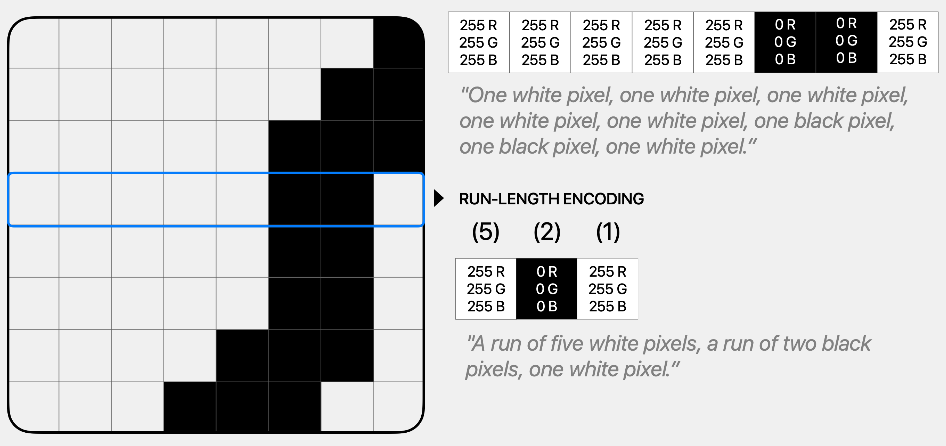
  - `Lossy compression` creates an approximation of the original information, resulting in lower quality.
    - 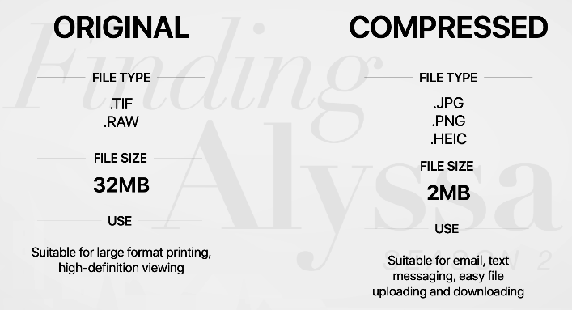
    - Depending on the compression settings, it may be hard to tell the difference.
    - Lossy image compression typically involves complex math.
    - If you zoom into an image to examine it pixel by pixel, you'll be able to see the effects of compression.
    - But when you view it on your screen, even a computer desktop, a lossily compressed image can look identical to the uncompressed version.
    -  

### Posting on Social Media

#### Metadata

- Your social media post starts with the photo and the text associated with it.
- But a social media service requires more specific data to perform the functions you expect of it.
  - This information is called metadata - data about data.
- Metadata is essential for organizing and managing information.
  - For example, to organize all the posts in your timeline in chronological order, the server has to know what day and time the post was created.
  - Changing the post's metadata, such as the number of Likes, doesn't change the data itself.
  - 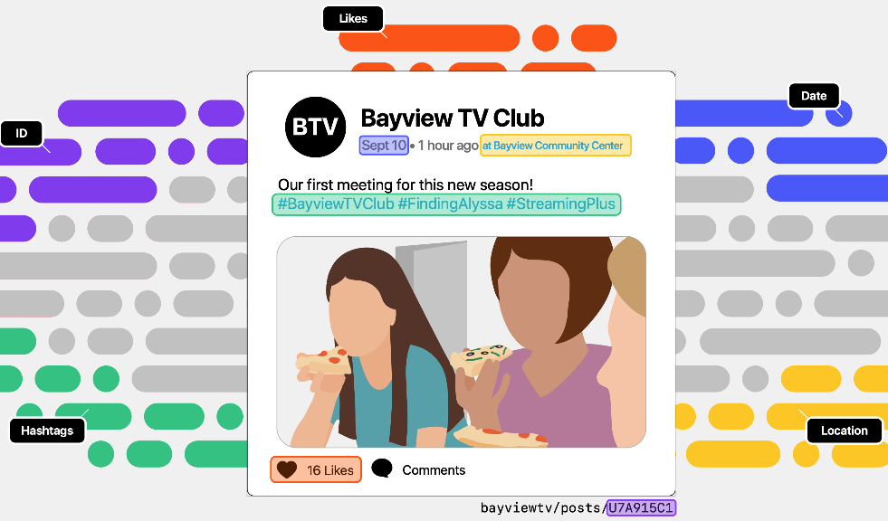

#### Building Feeds

- To build a feed, the server performs two steps
  - It queries the database for new posts from each of the followed users.
  - Requesting only those posts whose date and time is more recent than the last time the feed was updated.
  - It takes the resulting list of new posts from all followed users and sorts it by date and time - or uses an internal algorithm to sort and filter them in some other way.
  - Searching for posts with a given hashtag works much the same way.
  - The server takes the resulting list of posts and sorts them by date and time - or uses some other algorithm.

#### Parallel and Distributed Computing

- In the early days of computing, computers could only do one thing at a time.
  - This sequential computing model - also known as serial processing - meant that they had to complete all operations in order, one after the other.
- Fortunately, modern computers are capable of parallel computing.
  - They can perform several operations simultaneously, provided the operations are independent of each other.
  - If a computer can execute two queries in parallel, it could potentially complete the job two times as fast.
- But one computer can't keep up with the demands of a popular social media service, even if it can perform many operations in parallel.
  - The solution is to rely on `distributed computing`.
  - The data center for a social media platform typically houses hundreds or thousands of servers, each handling many requests every second.

## Building Apps

### Get Started With App Development

#### Apps

- Apps can be described by their behavior.
  - The inputs they accept, how they accept them, and the nature of the outputs they produce.
  - Apps receive all kinds of input: touches on their screens, files, sensor input (such as a camera), data from the internet.
  - Inputs can even come from other programs.
    - For example, you can use the Share sheet in your Photos app to send a photo to another editing app, or to include it in a message to your friend.
  - When it comes to output, apps can return images, sounds, music, text, tactile sensations, and animations.
- While a user might describe an app in terms of its behavior, a developer might also describe it by explaining how its code and the underlying algorithms work together to accomplish its function.
  - Developers have to design their apps to work for a wide variety of inputs and situations.
    - The output of a program depends on its input and the state it's in.
      - For example, what happens when an email app is offline, when its users write in a language that displays text from right to left, or when a message is addressed to a nonexistent email account? What if users have low vision and require accessibility accommodations such as VoiceOver?
  - Good app designers anticipate the variety of ways their apps will be used, and will write code to handle those circumstances.

#### Events

- Apps receive much of their input in the form of events that they don't control.
- An event might represent a user action such as a tap or swipe, or other actions such as an incoming phone call or data arriving from the network.
- Much of the code you write for an app is event-based, executing in response to a constantly changing environment.

##### Function Callbacks

- Callback is a general term for any code that executes in response to events.
- You used a specific style - assigning a function to a callback property - to handle events such as collisions and user touches in the BouncyBall game.

##### Delegates

- Delegation is a common pattern for division of labor within an app - a controller-delegate relationship.
- By delegating the responsibility for a set of tasks to another object, a controller can ignore the details of how they're accomplished.
- Its delegate, a faithful assistant, just has to focus on its tasks, responding reliably and efficiently, without being concerned about the broader context.
- You used the delegation pattern in the QuestionBot project - though you didn't use the term then.
- Your `responseTo(question:)` function was called when the app needed to respond to the user entering their question.

##### Data Sources

- Data sources are similar to delegates.
- They're also typically managed by controllers and respond to the demands of the app.
- Whereas delegates perform tasks for a controller, data sources are meant to supply data to a controller.
- As the name implies, a data source primarily works with the types and instances that form the backbone of the content inside the app.

##### Outlets and Actions

- Outlets
  - An outlet connects a variable in source code to an object in the storyboard, allowing the code to access those objects and get information or make changes when the app is running.
- Actions
  - An action connects a method in source code and a control in Interface Builder, enabling the code to run when a user interacts with the app's controls.
  - For example, a certain method may be associated with a button tap or a switch update.
- When you develop an app, you write Swift code and you build your UI in a storyboard.
- In order for the two to work together, they must be connected.

#### Debugging

- The Swift compiler will instantly tell you when you've made an error.
  - You've learned over time what these error messages mean and how to fix them.
  - Those easy-to-spot errors are called `syntax errors` (or sometimes compile-time errors) because they involve checking the written code without running it.
- But somethimes you don't see the result of the errors in your code until you run an app.
  - This kind of error is a run-time error.
  - You've already seen some of the ones defined by Swift, such as out-of-bounds array indices, division by zero, and integer overflow.
- The most perplexing error is when your app runs without crashing, but doesn't work correctly.
  - These logic errors are among the most difficult to solve, because you get no direct clues from Xcode, Swift, or iOS to help you fix them.
- When you debug your code, you have to look for clues and reason backwards to find the culprit.
  - The more you encounter bugs, the more easily you'll be able to find and correct them.
- You might create a run-time error if you:
  - Misuse an index in a loop or an array by over - or undercounting (an off-by-one error).
  - Make a mistake in Interface Builder.
- Or you might encounter a logic error if you:
  - Make a simple typo, like putting a + where you should have had a -.
  - Copy and paste code that follows a common pattern, but forget to alter the part that differs.
  - Set a variable to the wrong value.
  - Set s variable at the wrong time - too early or too late.
  - Forget to insert or remove an item from an array.
- Logic errors are the trickiest bugs to solve, because they can arise from your misunderstanding of the algorithm.
  - You may write your code perfectly, avoiding all the common slipups, yet still fall into a trap.
  - To fix a logic error, you'll have to go all the way back to your thought process when you designed your code in the first place.
- Whe hunting down bugs, here are a few helpful strategies you can use.
  - Output Statements
    - A simple way to see the values of variables while your program is running is to embed print statements at different points in your code.
    - These are quick and simple ways of using output for solving simple problems.
    - However, as your apps become more complex, you'll probably find the debugger more useful for finding and fixing problems.
  - Xcode Debugger
    - Built into Xcode is a robust debugger tool that allows you to set breakpoints - places where program execution will halt.
    - At that point, you can inspect the values of variables, and even see the state of the program's memory where execution halted.
  - Visualization
    - You've had experience creating graphical representations fo your algorithms and data.
    - Sometimes it's helpful to return to those when you encounter bugs.
    - Try tracing your algorithm through a flowchart, and talk yourself through its steps to see where things might be going away.
    - You can also analyze the performance of your app in real time using Instruments, an advanced tool that provides other forms of visualization, such as graphs of how hard the processor is working.
  - A Word of Encouragement
    - One thing to remember:
      - You can go about debugging bit by bit.
      - Don't try to solve the problem all at once.
      - If you find on clue, test it by running your code again.
      - If necessary to confirm your suspicion, make small isolated changes in your code, like printing to the console or changing the value of a key variable.
      - Once you're sure that you're on the right track, figure out what new questions you can ask.
      - Don't be discouraged.
        - Debugging can take persistence and patience.
        - But there's nothing quite like the feeling of squashing a particularly nasty bug.

#### App Testing

- Testing is a great way to minimize the amount of debugging you have to do.
- As you develop your app, you'll form habitual use patterns that let you quickly test your code every time you build and run the project.
- When you head off into uncharted territory, don't just tap and swipe randomly.
- Try to anticipate all the paths that users can take.
- Each unique sequence of actions will cause the app to respond in a certain way.
- If you're systematic, you can create a representative sample of the possible pathways through your app, much the same as you would when testing a function.
- Then, when something breaks, you'll know how to reproduce it according to the specific sequence of actions you followed.
- The easiest way to fix a bug is to know the exact sequence of actions that caused the app to malfunction and that can be reproduced 100% of the time.
- And when you encounter a bug in somebody else's app, you'll know that's the kind of feedback that will make a difference.

### Play With App Components

#### Color Picker

- In this lesson, you'll learn how to connect Swift code to the views and controls you create in a storyboard, so your code is able to respond to the user's actions
- There are two kinds of connections between storyboards and code:
  - `Outlets` connect variables in your code to objects in the storyboard, so you can access those objects from your code and get information or make changes to them when the app is running.
  - `Actions` connect controls like switches and buttons to methods in your code, so tapping a button, for example, will run a particular method.
- Your project will be to use outlets and actions to create an app that generates colors by mixing red, green, and blue.
- You'll use incremental development to make your work manageable.
- Part one: Learn how to use outlets to connect objects in the storyboard to your code, so you can access them when your app is running.
- Part two: Learn how to connect actions from a switch in the storyboard to your code, so that a piece of code is run when the user changes the switch.
- Part three: Create multiple switches, and use actions and outlets to display a color based on the on/off status of each switch.
- Part four: Add sliders to allow more precise color control.
- Part five: Add a reset button to set the switches and sliders back to their original values.
- Part six: Polish the user interface to make the purpose of the switches and sliders easy to understand.

##### Part 1 - Creating Outlets

- Outlets are a way for your code to control your app's interface.
- In this part, you'll add a view to the scene in your storyboard, define an outlet in your Swift code that connects to the view, and use the outlet to set the background color of the view in code.

####### Adding the Color View and Its Outlet

1. Create a new Xcode project > App within the iOS tab > Name: ColorMix
2. Using the project navigator, open the Main.storyboard.
3. Click the Devices icon at the bottom of the window and select iPhone 14 Pro from the popup that appears.
4. Find a View in the Object library. Remember you can use the search field to narrow down the list of options.
5. Drag the View onto the view controller scene. Drag it near the top of the scene, then use the blue guides to center it horizontally.
6. Choose Editor > Canvas > Bounds Rectangles to see an outline of everything in the scene.
7. Open the assistant editor by click Adjust Editor Options > Assistant.
   1. Make sure you can see ViewController in the assistant editor; if not, check that the jump bar at the top of the assistant editor is et to automatic.
8. Control+drag from the view you added into the code above `override`.
9. Make sure Outlet is chosen in the Connection pop-up menu.
10. Enter colorView in the Name field.
11. Click Connect.
    1. Code will be created, `@IBOutlet weak var colorView: UIView!`.
       1. Circle: The filled circle indicates that the outlet is conected. If the outlet wasn't connected, it would be an empty circle.
       2. `@IBOutlet weak`: This is a signal to Xcode that the property on this line is an outlet.
       3. `var colorView`: This is the declaration of a property you are already familiar with.
       4. `: UIView!`: The type of the property is UIView!.
          1. The exclamation point means that if the outlet isn't connected and you try to access this property, your app will crash.
          2. UIView is the basic view type used in all iOS apps.
          3. Almost everything you see on the screen is a kind of UIView, which is responsible for drawing and handling touches.
       5. The important thing to remember is that when you use colorView in the ViewController code, you're referring to the view you've just added to your storyboard.

###### Setting the View's Color

- Find the function `viewDidLoad()`.
- This function is called when your view controller is ready to appear on the screen.
- Inside it, add `colorView.backgroundColor = .black`.
- When the items from the storyboard have all been created and the outlets and actions have all been connected, `viewDidLoad()` is called.
- The view you see in the storyboard doesn't change color, because the code doesn't run until the app is run.

###### Troubleshooting Disconnected Outlets

- Sometimes you’ll build and run your app with no errors, but the app immediately crashes on launch. Your device (or the simulator) shows your Home screen with an error in the console, like this:
  - `*** Terminating app due to uncaught exception 'NSUnknownKeyException', reason: '[<YourApp.ViewController 0x7f8378f05b00> setValue:forUndefinedKey:]: this class is not key value coding-compliant for the key someNameFromYourApp`
- This is a common error when you're working with actions and outlets. Unfortunately, the error message doesn’t tell you that the problem actually stems from a view in Interface Builder, but that’s exactly where you need to look.
- It's not unusual to change the name of a variable in your code. Perhaps you misspelled it, or you thought of a better name.
  - For practice, change the name `colorView` to `colorSwatch` where it's declared and where it's used in viewDidLoad().
  - Now try to run your app. It should crash with an error as illustrated below.
  - 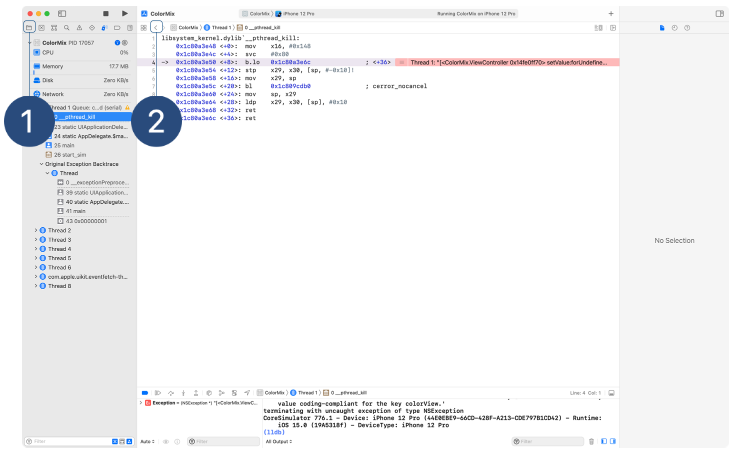
  - Go back to your storyboard.
    - You can use the navigator (make sure to select the project navigator tab(1) at the top), or you can use the back button < on the left of the jump bar (2) to navigate back to the file that was showing before the crash.
- Select View Controller, either in the Document Outline(1) or by selecting the yellow circle at the top of the main editor in Interface Builder(2).
  - Now open the Connections inspector on the right side of the screen.
  - Near the top of the Connections inspector, you'll see all the outlet connections for the selected view controller(3).
  - 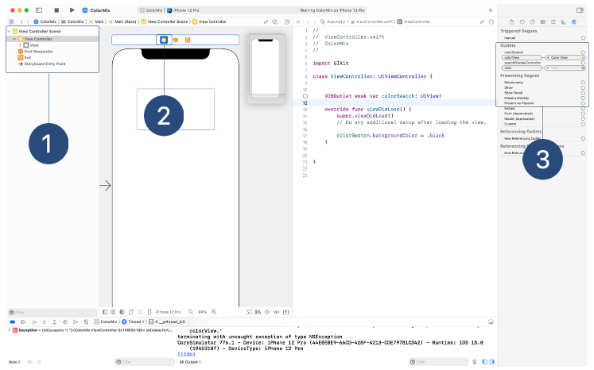
- In the list of outlets, you sould see bouth `colorView` and ``colorSwatch`.
  - `colorSwatch` isn't connected, and `colorView` has a little yelllow hazard sign with an exclamation point.
  - Interface Builder is warning you that it has a connection that doesn't match your cord.
  - Renaming an outlet propert doesn't automatically update the connections in your storyboard.
  - That's why you see both properties in the list.
  - The mismatch won't be discovered until the app launches and tries to hook up all its connections - at which point, the storyboard file will try to open a connection to a name that no longer exists. And your app will crash.
- You can remove invalid connections by clicking the "x" next to the element's name.
  - You can remove valid connections this way, too.
- The `colorView` outlet should disappear entirely.
- To connect the new `colorSwatch` outlet to the view, click and drag from the empty circle on the right of the outlet to the view in the Main.storyboard.
  - Run the app again. This time, it should once again launch and function properly.
- Be sure to restore the name of the outlet back to `colorView` so you can continue following the lesson.

##### Part 2 - Creating Actions

- An action runs your code when the user does something.
- In this part, you'll add a `UISwitch` control.
  - You'll define an action method and connect it to the switch.
  - When the switch is tapped, your code will change the color of the color view.

1. In Xcode, open the `Main.storyboard`.
2. Find a switch in the Object library and drag it onto the screen.
   1. Use the guides to center it horizontally and vertically.
3. In the Attributes inspector, set the State value of the switch to Off.
4. Open the assistant editor so that ViewController is visible.
5. Control+drag from the switch into the ViewController class and release.
   1. Make sure Action is seleted in the Connection pop-up menu.
   2. Enter `switchChanged` in the Name field.
   3. Enter "UISwitch" in the type field.
   4. Click Connect.
   5. The code will be created, `@IBAction func switchChanged(_ sender: UISwitch) {}`
      1. `@IBAction`: This line signals to Xcode that the method on this line is an action connected to a control in Interface Builder.
      2. `sender`: The sender argument is the UI element that initiated the action.
         1. You chose the type `UISwitch`, since you know that's the type of storyboard object connected to this `IBAction`.
6. Add the following code inside the method.

   1. `isOn` is a Bool property of UISwitch that describes if the switch is on or not.

   - ```swift
      if sender.isOn {
          colorView.backgroundColor = .red
      } else {
          colorView.backgroundColor = .black
      }
     ```

##### Part 3 - Multiple Actions and Outlets

- When you see color on the screen, you’re actually seeing three components: red, green, and blue.
- In this part of the lesson, you’ll add two more switches to the app, so you’ll have one switch for red, one for green, and one for blue.
- Switching each one on or off will add that color component to the color displayed on the screen.
- To make this work, you'll need to create outlets for each switch, so that the isOn property of each switch can be checked when creating the color to be displayed.

###### Adding More Switches

1. In Xcode, go to the Main.storyboard and select the switch.
2. Type Command+D to duplicate the switch. Drag it underneath the first one, using the guides to lien them up.
3. Repeat step 2 to add a third switch.
4. Open the assist editor to show ViewController.
5. Control+drag from each switch to the code file to create outlets.
   1. Call them `redSwitch`, `greenSwitch`, and `blueSwitch`.

- A common technique is to connect outlets and actions to the same object. Select the middle switch and open the Connections inspector in the utilities area.
- The image below shows all of the outlets and actions the selected switch is connected to.
  - 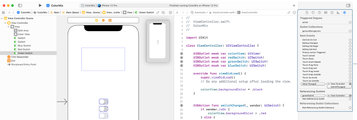
  - In Sent Events, you can see that the `Value Changed` event is linked to `switchChanged:` in ViewController. Although you could link to the other events, only the Value Changed event is sent when a switch is switched.
  - Referencing Outlets shows that the switch is referenced by greenSwitch in ViewController. Because you duplicated the red switch instead of adding new ones, it's already connected to the switchChanged action.
  - Follow these steps to learn another way to connect actions:
    1. In the Connections inspector click the X button by the Value Changed event. This will disconnect the green switch from the action.
    2. In the ViewController file in the assistant editor, find the circle icon in the gutter next to the `switchChanged` action method. When you mouse over it, the red switch and blue switch will be highlighted in the storyboard to indicate that they're connected.
    3. Drag from the circle onto the green switch to reconnect the action.
- They are many ways to connect outlets and actions.
  - Control+Dragging from the storyboard to code can create new outlets and actions.
  - Once they're in place, they can be connected, disconnected, and reconnected from the Connections inspector or from the circle icons in code files.
- Which is better?

  - Use the **Connections inspector** if you want to know **which outlets and actions a particular object in the storyboard is connected to**.
  - Use the **circle icons in code** if you want to know **which objects a particular outlet or actions is connected to**.

  - ```swift
      import UIKit

      class ViewController: UIViewController {
          @IBOutlet weak var colorView: UIView!
          @IBOutlet weak var redSwitch: UISwitch!
          @IBOutlet weak var greenSwitch: UISwitch!
          @IBOutlet weak var blueSwitch: UISwitch!
          @IBAction func switchChanged(_ sender: UISwitch) {
              if sender.isOn {
                  colorView.backgroundColor = .red
              } else {
                  colorView.backgroundColor = .black
              }
          }

          override func viewDidLoad() {
              super.viewDidLoad()
              colorView.backgroundColor = .black
          }
      }
    ```

###### Updating Your Code

- The action method is not the base place to update the color of the view.
- There's already some repeated code in the file - the color is set to black in `viewDidLoad` and again when the switch is turned off.
- A better design is to have a single function that makes the correct color based on the state of each switch, and to call this from the action method and from `viewDidLoad`.

  - That way there's no repeated logic.
  - If different actions are added that can also update the color, they can call this new function as well.

  - ```swift
      import UIKit

      class ViewController: UIViewController {
          @IBOutlet weak var colorView: UIView!
          @IBOutlet weak var redSwitch: UISwitch!
          @IBOutlet weak var greenSwitch: UISwitch!
          @IBOutlet weak var blueSwitch: UISwitch!
          @IBAction func switchChanged(_ sender: UISwitch) {
              updateColor()
          }
          func updateColor() {
              var red: CGFloat = 0
              var green: CGFloat = 0
              var blue: CGFloat = 0
              if redSwitch.isOn {
                  red = 1
              }
              if greenSwitch.isOn {
                  green = 1
              }
              if blueSwitch.isOn {
                  blue = 1
              }
              let color = UIColor(red: red, green: green, blue: blue, alpha: 1)
              colorView.backgroundColor = color
          }

          override func viewDidLoad() {
              super.viewDidLoad()
              colorView.backgroundColor = .black
          }
      }
    ```

###### Reminder: Troubleshooting Problems With Actions and Outlets

- When you make an outlet or action, you're making changes in two places.
  - You add the `@IBOutlet` or `@IBAction` line to the Swift code, and you add information to the storyboard file that links the view with the outlet or links the control event with the action.
- If you delete the code part of the outlet or action but don't change the storyboard, your app will likely crash.
  - When the outlet is assigned or the action is fired, there won't be any code matching it - a crashing error.
  - To resolve the error, you mush make sure both to disconnect unwanted actions and outlets from the storyboard and to delete them from your code.

##### Part 4 Sliders

- Since each switch represents a binary choice, you can only make eight colors.
- In this part of the lesson, you'll add slider controls - like the brightness or volume sliders on an iOS device - to provide finer control.

###### Adjusting Your UI

1. Select all three switches by Shift-clicking each one or by dragging a selection box around them.
2. Drag the group of switches over to the left and up, so that the central switch is vertical centered in the scene and all three switches are aligned to the left margin guide.
3. Select the top switch only, then hold down the Shift key and press the Up arrow key four times to move it farther the central switch.
4. Select the bottom switch, do opposite way of the top switch.
5. Find a slider in the Object library and drag it onto the scene. Using the guides, align it vertically with the top switch, and horizontally within the scene.
6. Repeat this for the orhter switches.
7. Drag or Shift-click to select all three sliders.
8. In the Attributes inspector, set the value to 1. Notice that a slider also has a minimum and maximum value.

###### Connecting Outlets and Actions

1. Open the assistant editor so ViewController is showing.
2. Control+drag from each slider into the file to create outlets. Name them `redSlider`, `greenSlider`, and `blueSlider`.
3. Control+drag from the top slider into the file to create an action, called `sliderChanged`.
4. Add `updateColor()` into `sliderChanged` action method.
5. Update each line on `updateColor` so that it uses the value of the corresponding slider instead.

   - ```swift
      func updateColor() {
          var red: CGFloat = 0
          var green: CGFloat = 0
          var blue: CGFloat = 0
          if redSwitch.isOn {
              red = CGFloat(redSlider.value)
          }
          if greenSwitch.isOn {
              green = CGFloat(greenSlider.value)
          }
          if blueSwitch.isOn {
              blue = CGFloat(blueSlider.value)
          }
          let color = UIColor(red: red, green: green, blue: blue, alpha: 1)
          colorView.backgroundColor = color
      }
     ```

##### Part 5 Reset Button

- One of the most common controls in iOS apps is a button.
- A button can contain text, an image, or a mix of both.
- When the user taps the button, something happens.

###### Adding the Button

- Open the Main storyboard and find a button in the Object library.
- Drag it onto your scene, using the guides to center it horizontally, and place it near the bottom of the screen.
- Select the button and change the title to "Reset" by double-clicking it and editing the text or by using the Attribute inspector.
- Open the assistant editor, making sure it's displaying ViewController, then Control+drag from the button to the code file to create an action. Call the action `reset`. The code should look like this:

  - ```swift
      @IBAction func reset(_ sender: Any) {
      }
    ```

- Open the Connections inspector. You'll see that the button has been connected to the `Touch Up Inside` event. This is the standard event used for most buttons.

###### Updating the Code

- Your Reset button will set the value of each slider to 1 and the `isOn` property of each switch to false.
- Add that code to the new action method.
- To update the color displayed on the screen, add a call to `updateColor()` at the end of the action method.

  - ```swift
      @IBAction func reset(_ sender: Any) {
          redSlider.value = 1
          redSwitch.isOn = false
          greenSlider.value = 1
          greenSwitch.isOn = false
          blueSlider.value = 1
          blueSwitch.isOn = false
          updateColor()
      }
    ```

##### Part 6 Polishing the Interface

- There are some things about the interface that could use improvement:
  - All the switches and sliders look the same. There's no way to tell what control does what without using it.
  - When all components are on, the color view disappears into the background.
  - If a switch is off, the slider can still be operated, but it doesn't do anything - which may be confusing for the user.

###### Tinting the Switches

- A switch can have two custom colors: the `On Tint` and the `Thumb Tint`, which affect the following areas of the switch:
  - 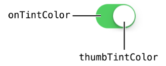
- Now change the on tint for each switch to match the color it controls.
  1. In Xcode, open the Main storyboard and select the red switch.
  2. Open the Attributes inspector.
     1. Under teh Switch heading are two tint options.
     2. Change the value in the `On Tint` pop-up menu.
        1. Select System Red Color for this switch.
     3. For each fo the other two switches, follow the same steps to select System Green and System Blue.
- You'll notice that the scene doesn't change when you change the colors.
  - That's because the switches are all set to off.

###### Tinting the Sliders

- Sliders have three tinting options.
- You can set the color of the track (the line the handle moves along) on the low and high slides of the thumb, and on the thumb itself.
  - 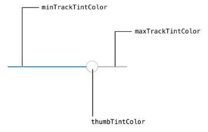
- Select one slider at a time, then use the Attributes inspector to set the Min Track color to be red, blue, or green as appropriate.

###### Adding a Border

- To make the color view stand out from the background, regardless of the currently selected color, you can add a border to the view.
- This can be done in code. Switch to ViewController and add the following lines to viewDidLoad():

  - ```swift
      colorView.backgroundColor = .black
      colorView.layer.borderWidth = 5
      colorView.layer.cornerRadius = 20
      colorView.layer.borderColor = UIColor.black.cgColor
    ```

  - This code uses the layer property of a UIView, which in turn has its own properties.
  - This code creates a black border, five points wide, with rounded corners.

###### Disabling Sliders

- All controls have a property, `isEnabled`, that allows the control to be activated or deactivated.
- The status of a control is accompanies by a change in its appearance, such as a dimming effect.
- Add a new method to make sure all of the sliders are enabled properly,

  - and then call the method whenever a switch is changed
  - then add a call from `viewDidLoad()` so that the sliders are disabled correctly when the app first launches.
  - Also add a call from `reset(_:)` so it works when you reset the app.

  - ```swift
      @IBAction func switchChanged(_ sender: UISwitch) {
          ...
          updateControls()
      }
      @IBAction func reset(_ sender: Any) {
          ...
          updateControls()
      }
      func updateControls() {
          redSlider.isEnabled = redSwitch.isOn
          greenSlider.isEnabled = greenSwitch.isOn
          blueSlider.isEnabled = blueSwitch.isOn
      }
      override func viewDidLoad() {
          ...
          updateControls()
      }
    ```

#### ChatBot

- ChatBot will have
  - A list of messages forming a conversation.
  - Messages entered by the user that look different from those given by the app.
  - A "thinking" indicator.
  - An entry area where the user can type a question.
- In iOS apps, a scrolling list of items is known as a table view.
- Each item in the list is called a cell.

##### Part 1 Exploring the Project

- Open the project called ChatBot.xcodeproj.
- Make sure you can see the project navigator. If you can't, choose View > Navigators > Show Project Navigator.
- The files that make up the app are collected into groups. You'll only be working with the files in the Model group for this project.
- Here's a summary of what the other files in the project are for, in the order they'ar shown in the project navigator.
  - UI
    - Main: The interface of the app, including the layout of the screens.
    - LaunchScreen: The screen displayed when the app is first launched (an empty white screen).
    - ThinkingCell: A specialized cell for showing the app is thinking.
    - ConversationCell: A specialized cell for showing a message in the conversation.
    - AskCell: A specialized cell for allowing the user to type in a question.
  - Assets: The asset catalog holding all of the images used in the app.
  - Controllers
    - ConversationViewController:
      - The main view controller for the app.
      - This class is responsible for the list view and handling updates when the user asks questions.
      - It's the most complicated file in the project, and contains a lot of code you haven't learned about yet.
  - Model: Details of this group are given below.
  - Support files:
    - AppDelegate: Part of the standard app template, normally used to handle events such as the app being launched.
    - Info: Part of the standard app template, holding information about the app itself.
- Inside the Model group are three Swift files:
  - Message
    - The app will show you a conversation between you and a robot.
    - This file describes the things that can make up a conversation.
    - The conversation is going to hold two types of messages: questions and answers.
    - The MessageType enum holds the two possible values, `.question` and `.answer`.
    - The Message struct holds the information needed to make an entry in the conversation: the date, the message text, and the type of message.
    - To create a question, you use the Message initializer like this: `let question = Message(date: Date(), text: "Do you know the way to Cupertino?", type: .question)`
      - This code wil create a Message instance with the current date (given by `Date()`) and a type of `.question`.
    - You can see an example for the `openingLine` constant at the end of the file.
      - This `openingLine` creates a standard opening line to be used anywhere in the app.
  - ConversationDelegate
    - This file, formerly known as QuestionAnswerer, may be familiar from the QuestionBot lesson.
    - The ConversationDelegate struct is the brain of the chat and is responsible for providing answers to question.
    - The conversation view controller owns the conversation delegate and uses it to get answers from question the user enters.
    - Delegation is a common pattern for providing information to other parts of an app based on their demands.
    - You didn't write the code to call the `answerTo(question:)` function.
    - The app knows to ask your conversation delegate to provide an answer when the user poses a question.
    - The view controller delegates the responsibility of answering questions to your code so that it doesn't have to know about the details of how questions are answered.
  - ConversationDataSource
    - The ConversationDataSource class is responsible for holding and updating the details of the current conversation.
    - The conversation view controller owns the data source.
    - The data source is best thought of as a lightning-quick, very attentive assistant that waits to be asked for information or to be given orders.
    - In this case, the questions and orders are:
      - How many messages are there?
      - Add this question to the conversation.
      - Add this answer to the conversation.
      - What is message number X?
    - The view controller asks these questions or gives those orders based on the user's actions in app.
    - This arrangement is very common when writing apps.
    - The data source doesn't deal with anything other than the information about conversation.
    - Showing things onscreen or dealing with what the user types in is handled by the view controller.
    - As you've learned before, being able to focus on one job makes your code easier to write and easier to understand.
    - A data source is another example of a way to respond to the circumstances of your app as it runs, rather than calling your code directly.
    - The view controller knows when to ask the data source what it needs to know, so your code is called on demand.
    - Currently, ConversationDataSource doesn't do anything when given orders, and doesn't give very helpful answers when asked for information.
    - There are print statements in the methods so that you can keep track of when they're being called.
- This diagram shows a summary of how some of the instances in the app work together:
  - 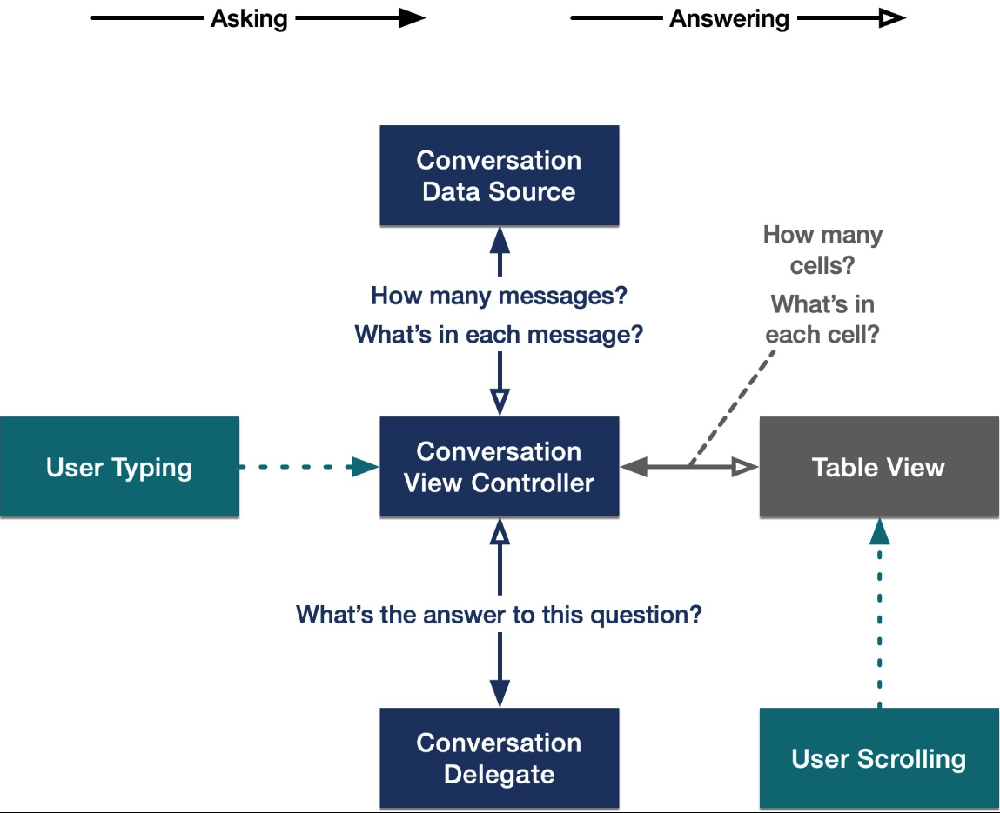
  - In some kinds of iOS apps, nothing happens until an action is performed.
  - Those user-initiated actions, like swiping or tapping, are called events.
  - Because so much that an app does is governed by events, much of the app code you write will run when it's triggered by the user.
  - There are two types of events that ChatBot reacts to: the user scrolling the table and the user entering questions.
  - When those events happen, your conversation data source will be asked to perform its duties.

##### Part 2 Examining the Code

- Build and run the app.
- If you check in the console in Xcode, you won’t see any of your print statements yet.
- That's because you've only launched the app and haven't triggered any events - so your code in ConversationDataSource hasn't run.
- Enter a question. The app will think a little bit, then will go back to looking just like it did before.
- Check the console again. Entering a question generated an event, which ran some code.
- So now you'll see two messages generated by the print statements:
  - Asked to add question: … was printed when you first tapped the return key and asked the question.
  - Asked to add answer: … was printed when the app was done thinking about your question and decided to give an answer.
- Nothing changed on the screen, because the data source says there aren't any messages in the conversation.
- Your data source's current capabilities look like this:
  - How many messages are there? – None.
  - Add this question to the conversation! – I’ll print to the console, but I’m not doing anything else!
  - Add this answer to the conversation! – I’ll print to the console, but I’m not doing anything else!
  - What is message number X? – The answer “Hello, world!”
- You never saw the line Asking for message at index … in the console, because the data source says there are no messages in the conversation.
- The app fills the table view based on that answer, so it doesn't ask for any messages.
- Now you’ll look at each aspect of the data source in turn and explore what’s happening.

##### Part 3 Fixing the Message Count

- Change the `messageCount` property in `ConversationDataSource` to have a value of 1 instead of 0: `let messageCount = 1`.
- You can see a single message in the conversation.
- Check in the console and you'll see this message:
  - `Asking for message at index 0`
- If you ask a question, you'll see that night changes, but you still see the console messages about adding question and answer messages.
- Now the data source's capabilities look like this:
  - How many messages are there? - One
  - Add this question to the conversation! - I'll print to the console, but I'm not doing anything else!
  - Add this answer to the conversation! - I'll print to the console, but I'm not doing anything else!
  - What is message number X? The answer "Hello, world!"
- What should really happen is that each time a message is added to the conversation, the data source should update the number of messages so it can give the correct answer the next time it's asked.
- Change the definition of the `messageCount` property to a `var` instead of a let and set the initial value back to 0.
- Inside the `add(question:)` and `add(answer:)` methods, after the `print` statement, add `messageCount += 1`.
- This increases the `messageCount` property each time a message is added to the conversation.
  - You can see that the right number of message are displayed, and in the console the data source is being asked for messages at indexes 0 (for the question) and 1 (for the answer).
- Now the data source's capabilities look like this:
  - How many messages are there? - The total number of questions and answers you've given me.
  - Add this question to the conversation! - I'll print to the console, and I'll update my message count.
  - Add this answer to the conversation! - I'll print to the console, and I'll update my message count.

##### Part 4 Working With Indexes

- To show message in the conversation, remove the `return` line from `messageAt(index:)` and replace it with this:

  - ```swift
      if index % 2 == 0 {
          return Message(date: Date(), text: "Question \(index / 2)", type: .question)
      } else {
          return Message(date: Date(), text: "Answer \(index / 2)", type: .answer)
      }
    ```

- This code uses the remainder (or modulo) operator, which you saw in a previous lesson, to determine if the message should be a question or an answer, then it creates and returns something appropriate.
- Now your app is showing the right number of messages in the conversation, the questions and answers are showing up correctly, and you're seeing different text as you move through the conversation.
- But it isn't showing the actual contents of the conversation.
- Now the data source's capabilities look like this:
  - How many messages are there? - The total number of questions and answers you've given me.
  - Add this question to the conversation! - I'll print to the console, and I'll update my message count.
  - Add this answer to the conversation! - I'll print to the console, and I'll update my message count.
  - What is message number X? - If X is even, a numbered question, otherwise a numbered answer.

##### Part 5 Adding Storage

- The method of storage must be able to:
  - Store as many messages as required.
  - Keep the messages in a specific order.
  - Give back a message at a specific index.
- Declare messages array variable, store message in the array, and then return the message:

  - ```swift
      class ConversationDataSource {
          var messageCount = 0
          var messages = [Message]()
          func add(question: String) {
              messageCount += 1
              let message = Message(date: Date(), text: question, type: .question)
              messages.append(message)
          }
          func add(answer: String) {
              messageCount += 1
              let message = Message(date: Date(), text: answer, type: .answer)
              messages.append(message)
          }
          func messageAt(index: Int) -> Message {
              return messages[index]
          }
      }
    ```

##### Part 6 Refinements

- There's no longer any need for the separate `messageCount`, since you can just use the `count` property of Array to figure out how many messages there are.
  - In fact, storing redundant information can be the source of bugs if you make changes in one place but forget to make them elsewhere.
  - Delete the lines from `add(question:)` and `add(answer:)` where you increase the message count, then make the `messageCount` property a computed property: `var messageCount: Int { return messages.count }`
- In addition to the "Ask a question..." prompt, it's nice for the app to welcome the user and ask them to get started.
  - To add a welcome message, find the line where the messages array is initialized and replace it with this: `var messages = [openingLine]`.
  - The code above creates an array with a single message in it, rather than an empty array of message.
  - You don't need to change anything else, since `messageCount` is now a computed property which will have the right answer.
- For the last step, improve ChatBot's brain.
  - From the project navigator, open `ConversationDelegate` under the Model section.
  - Change the logic of the `responseTo(question: String)` implementation to return your won answers to the users queries.

#### Rock, Paper, Scissors

- To play the game, you'll tap one of the three signs.
- The app will randomly choose a responding sign and show the results.
- The Play Again button goes back to the first screen.
- You'll use the Model-View-Controller(MVC) design pattern to make this app.
  - The purpose of MVC is to separate the parts of your app, giving clearly defined responsibilities to each part.
  - That way, you'll keep your cod easy to read and easy to think about.
  - MVC is the default pattern used natively in the iOS SDK, Cocoa Touch' and consequently many iOS developer follow this pattern.
- You'll build the game logic (the model) first, followed by the UI (the view).
- Then you'll put the two together witht he controller.
- By now you've learned everything you need to build the app on your own.

##### Part 1 Creating the Model

- Create a new Xcode project using the App template and name the app "RPS".
- Creating a Sign Enum

  - In the project navigator, right-click (or Control-click) the gray folder named "RPS," and choose "New File...", and make sure that Swift File is highlighted in the dialog that appears.
  - After clicking Next, name the file "Sign" (the hidden ".swift" extension will be added automatically).
  - Make sure that the Group is set to the manilla RPS folder you clicked.
  - In the new file, create an enum with cases representing each sign.
  - Name the enum Sign.
  - Add a computed property to give the emoji that represents the Sign.

  - ```swift
      import Foundation

      enum Sign {
          case rock, paper, scissors

          var emoji: String {
              switch self {
              case .rock: return "👊"
              case .paper: return "✋"
              case .scissors: return "👆"
              }
          }
      }
    ```

###### Defining Game State

- There are four different states that the game can be in:
  - Start: The game is showing the tree signs and is waiting for the user to tap one of them.
  - Win: The player has won the app is showing each move and a winning message.
  - Lose: The player has lost and the app is showing each move and a losing message.
  - Draw: The game was a draw and the app is showing each move and a drawn message.
- Create another new Swift file to hold an enum with the four cases as named above.
  - Name the file (and the enum) `GameState`.
  - This diagram below shows the relationship between the turns and the state of the game:
  - 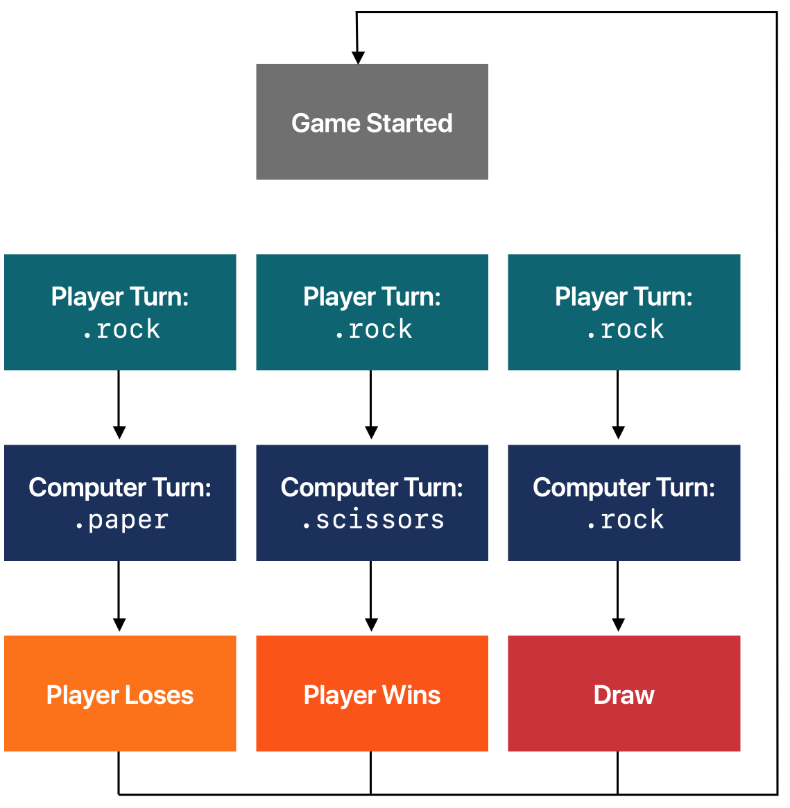
- You need to be able to compare two `Sign` instances to give a `GameState`.
  - For example, a player's `.rock` and the computer's `.paper` would give you `.lose`.
- Add an instance method to `Sign` that takes another `Sign`, representing the opponent's turn, as a parameter.
  - The method should return a `GameState` based on a comparison between `self` and the opponent's turn.
- There are many ways that you could write this function.
- You may wish to work in a playground first so you can check that all the possible combinations give the correct results.

  - GameState.swift

    - ```swift
        import Foundation

        enum GameState {
            case Start, Win, Lose, Draw
        }
      ```

  - Sign.swift

    - ```swift
        enum Sign {
            ...

            func beats(otherSign: Sign) -> GameState {
                if self == otherSign {
                    return .draw
                } else {
                    switch self {
                    case .rock:
                        if otherSign == .paper {
                            return .lose
                        }
                        return .win
                    case .paper:
                        if otherSign == .scissors {
                            return .lose
                        }
                        return .win
                    case .scissors:
                        if otherSign == .rock {
                            return .lose
                        }
                        return .win
                    }
                }
            }
        }
      ```

###### Generating a Random Sign

- You need a way to generate a random Sign to act as the app's turn.
- If you hand-code an array of arbitrary values, your app might look random at first glance, but yours would soon notice that it repeats the same sequence each time it runs.
- What you want is a process to generate a sequence of values that are completely different each time the app runs.
- The `Int` type has a method for generating random values called `random(in:)` which takes a `Range` argument.
- The `Range` type simply describes a range of values.
  - The easiest way to create a `Range` is to specify its upper and lower bounds separated by the closed range operator, `...`.
  - The resulting range contains all the values including the upper and lower bounds.
  - For example, the expression 1...100 represents all integers between 1 and 100.
- Add this function to the file at the top level (outside the declaration of the Sign enum):

  - ```swift
      func randomSign() -> Sign {
          let sign = Int.random(in: 0...2)
          switch sign {
          case 0:
              return .rock
          case 1:
              return .paper
          default:
              return .scissors
          }
      }
    ```

- This function gets a random number and then uses it to create a new `Sign` instance.
- You could now play a full game of Rock, Paper, Scissors by calling functions in a playground, but that's not as much fun as playing it for real. It's time to build the UI.

  - ```swift
      var playerOne = Sign.rock
      playerOne.beats(otherSign: randomSign())
    ```

##### Part 2 Building the View

- The UI of your app is the view component in the MVC design pattern.
- You'll create it first, then bring the app to life with the controller in the final part of the lesson.
- Switch to Main storyboard.
  - Click the Devices icon at the bottom of the window and select iPhone 14 Pro.
  - Drag a button from the objet library onto the scene, and change the button's title to the 👊 ("Fisted hand sign") emoji.
  - Set the font size to System 70.0 (font: System, size: 70).

###### Arranging UI Elements

- Duplicate the button twice and set the titles to the correct emoji: ✋ ("Raised hand") and 👆 ("backhand index finger point up").
  - Arrange the buttons in a horizontal line at the center of the scene.
  - To ensure they're aligned vertically, you can use the guides as you drag.
  - Space them out horizontally, estimating their positions so that they are as evenly distributes as possible.
- Drag in another button underneath the three hand sign buttons.
  - This will be the "Play Again" button.
  - Set it font to Title 1 in the Text Styles section of the menu.
- Drag in a label above the three hand sign buttons.
  - This will tell the user what's happening in the game.
  - Make it the full width of the view and choose Title 1 for the font.
  - Set Alignment up to center
- Drag in another label above everything else.
  - This will show the app's sign.
  - The font of this label should be the same as the font used for the emoji buttons.
  - Set Alignment up to center.
- 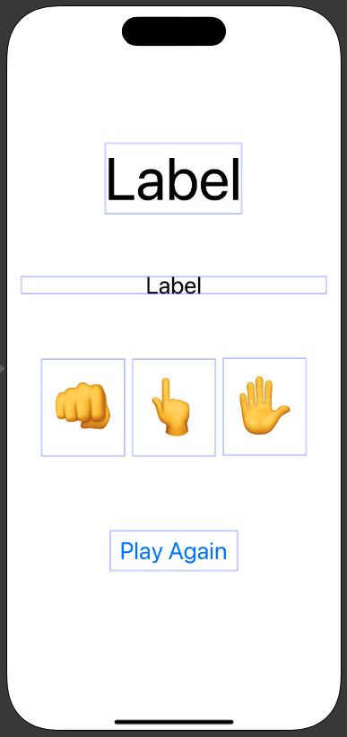

###### Making Connections

- Show the assistant editor, then create outlets so that you can update the screen during play:
  - The topmost label, which represents the app's sign
  - The next label, which represents the status of the game
  - One for each of the player sign buttons
  - One for the "Play Again" button
- Next, create actions to handle the button taps:

  - One fore each player button
  - One for the Play Again button

- ```swift
    import UIKit

    class ViewController: UIViewController {

        @IBOutlet weak var playAgainBtn: UIButton!
        @IBOutlet weak var paperSign: UIButton!
        @IBOutlet weak var scissorsSign: UIButton!
        @IBOutlet weak var rockSign: UIButton!
        @IBOutlet weak var appStatus: UILabel!
        @IBOutlet weak var appSign: UILabel!

        @IBAction func paperAction(_ sender: Any) {
        }
        @IBAction func scissorsAction(_ sender: Any) {
        }
        @IBAction func rockAction(_ sender: Any) {
        }
        @IBAction func playAgain(_ sender: Any) {
        }
        override func viewDidLoad() {
            super.viewDidLoad()
            // Do any additional setup after loading the view.
        }
    }
  ```

##### Part 3 Building the Controller

- You'll be adding code to ViewController to tie together the game logic and the outlets and actions.
- As the file name implies, this is your controller code - it connects your game model to the views in your UI.

###### Updating the User Interface

- Add a method to update the UI based on a GameState parameter.
- The method should do the following things:
  - Set the status label's text property to an appropriate message.
    - Should the text you use be a computed property on the GameState enum, or as a string literal inside the method you're writing?
  - Set a different background color to the main view depending on the state.
    - Remember, UIColor is the type that represents a color.
    - To access the main view, use the `view` property.
  - If the game is in the `.start` state, do the following:
    - Reset the computer sign label to the 🤖 emoji.
    - Hide the `Play Again` button by setting the value of the button's `isHidden` property.
    - Enable and show all of the player sign button.
      - This will make more sense after you've implemented the game features to hide and disable these buttons in a later step.
- There are two places where you should call this method in code right now, passing in `.start` as an argument in each call:

  - Add a call to the method you've just added from `viewDidLoad()`.
  - Add a call to the method you've just added from the action method linked to the `Play Again` button.

  - ```swift
      class ViewController: UIViewController {
          ...
          var currentGameState: GameState = .start
          func updateUI(_ gameResult: GameState) {
              switch gameResult {
              case .lose:
                  appStatus.text = "Sorry, you lose"
                  view.backgroundColor = .yellow
              case .win:
                  appStatus.text = "You win!"
                  view.backgroundColor = .green
              case .draw:
                  appStatus.text = "It's draw."
                  view.backgroundColor = .darkGray
              case .start:
                  appSign.text = "🤖"
                  appStatus.text = "Rock, Paper, Scissors?"
                  rockSign.isHidden = false
                  paperSign.isHidden = false
                  scissorsSign.isHidden = false
                  playAgainBtn.isHidden = true
                  rockSign.isEnabled = true
                  paperSign.isEnabled = true
                  scissorsSign.isEnabled = true
                  view.backgroundColor = .gray
              }
          }
          override func viewDidLoad() {
              super.viewDidLoad()
              updateUI(currentGameState)
          }
      }
    ```

###### Handling Player Button Taps

- You should now have separate action methods for each of the player buttons.
- And each of those methods should call a new method called `play`, which takes a `Sign` parameter.
- Add this new `play` method. This method should do the following things:
  - Get a randomly selected `Sign` to represent the app's turn.
  - Work out the `GameState` from the two signs, and call the update method you wrote earlier using the new `GameState`.
  - Set the app sign label to the appropriate emoji, using the computed property on `Sign` you created earlier.
  - Disable all of the player sign buttons.
  - Hide all of the player sign buttons except the one the player tapped.
  - Show the `Play Again` button.
- Make each of the player action methods call the play method, passing in an appropriate value of `Sign`.

  - ```swift
      class ViewController: UIViewController {
          ...
          @IBAction func paperAction(_ sender: Any) {
              play(Sign.paper)
              rockSign.isHidden = true
              scissorsSign.isHidden = true
          }
          @IBAction func scissorsAction(_ sender: Any) {
              play(Sign.scissors)
              rockSign.isHidden = true
              paperSign.isHidden = true
          }
          @IBAction func rockAction(_ sender: Any) {
              play(Sign.rock)
              paperSign.isHidden = true
              scissorsSign.isHidden = true
          }
          @IBAction func playAgain(_ sender: Any) {
              updateUI(currentGameState)
          }
          func play(_ playerTurn: Sign) {
              rockSign.isEnabled = false
              paperSign.isEnabled = false
              scissorsSign.isEnabled = false
              playAgainBtn.isHidden = false

              let opponent = randomSign()
              appSign.text = opponent.emoji

              let gameResult = playerTurn.beats(otherSign: opponent)

              updateUI(gameResult)
          }
      }
    ```

#### MemeMaker

- You're going to build an app that lets you add fun captions to a photo.

##### Part 1 Planning

- Before you dive into making the app, spend some time thinking about the content you're going to use.
- The app will need to following:
  - An image to go in the center
  - Some text options to go above the image, and an emoji to represent each one
  - Some text options to go below the image, and an emoji to represent each one
- Try to think of two, three or four choices for the top and the bottom.
  - It can be hard to think up working combinations of text.
  - If you get stuck, her's some inspiration:
    - Above the image
      - "You know what's cool?" could be represented by 🕶️
      - "You know what makes me mad?" could be represented by 💥
      - "You know what I love?" could be represented by 💕
    - Below the image
      - "Cats wearing hats" could be represented by 🐱
      - "Dogs carrying logs" could be represented by 🐕
      - "Monkeys being funky" could be represented by 🐒
- Once you have your ideas, you can get started building.

##### Part 2 Building the UI

- Create a new Xcode project using the App template, and name it "MemeMaker".
- On Main.storyboard, add the following items, placing them from top to bottom:
  - A segmented control
  - A label
  - An image view
  - A label
  - A segmented control
- Change the text of the top label to "TOP" and the buttom label to "BOTTOM".
- Segmented Controls
  - Segmented controls are used to offer a choice between a limited number of options.
    - For example, a Calendar app might have a segmented control to switch between day, week and month views.
    - Only one option can be selected at a time.
    - You can control the number of segments and the title of each segment.
  - When the user taps one of the segments, the Value Changed control event is sent.
    - From your code you can access the index of the selected segment.
    - In this app you'll update the caption labels when a different option is chosen.
- Adding the Image
  - Open the assets catalog and choose an image to drag in.
  - Select the image view and choose the Aspect Fit content mode in the Attributes inspector.
  - With the image view still selected, go to the Size inspector and set the width and height to 350, or another size that fits the screen.
  - Finally, use the Attributes inspector to choose the image that you've added to the project.
  - The image you've added to the Asset Catalog will be available in the Image pop-up menu.
- Finishing the Layout
  - Make sure that all your elements are centered on the canvas by using the blue guides that appear as you drag them.
  - One classic meme style (dating from the "I can haz" day) uses white all-caps block letters on the top of an image.
  - Move the two labels so that they're over the top and bottom of the image.
  - Use the Attributes inspector to adjust the following settings for each label.
    - Set Alignment to Center.
    - Set Lines to 0 - so that the label isn't limited to a particular number of lines.
    - Using the Font control, set Font to Custom, Family to Avenir Next Condensed, Style to Heavy, and Size to 30.
    - Set Autoshrink to Minimum Font Size with a value of 15.
      - The label will wrap its text automatically to fit its width.
      - If there's too much to fit at 30 points, it will reduce the font to as small as 15 points.
    - Set color to White Color.
    - Find the Shadow control and set it to Black Color, and set the Shadow Offset Width to 3 and its Height to 2.
  - Now that the labels are configured, resize them both so that they're as wide as the image and tall enough to fit two lines of text.
    - That size should be a good default setting for the text that you'd want to use in most memes.
  - 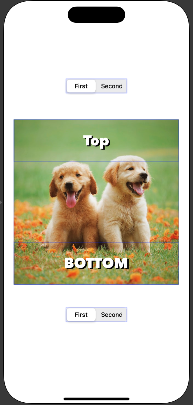
- Making Connections

  - Make outlets for the segmented controls in `ViewController`.
    - Name them `topSegmentedControl` and `bottomSegmentedControl`.
    - Then do the same for the labels, naming their outlets `topCaptionLabel` and `bottomCaptionLabel`.
  - Create an action from one of the segmented controls, then connect the same action to the other segmented control.

  - ```swift
      import UIKit

      class ViewController: UIViewController {

          @IBAction func bottomSegmentedAction(_ sender: Any) {
          }
          @IBAction func topSegmentedAction(_ sender: Any) {
          }
          @IBOutlet weak var bottomCaptionLabel: UILabel!
          @IBOutlet weak var topCaptionLabel: UILabel!
          @IBOutlet weak var bottomSegmentedControl: UISegmentedControl!
          @IBOutlet weak var topSegmentedControl: UISegmentedControl!
          override func viewDidLoad() {
              super.viewDidLoad()
          }
      }
    ```
